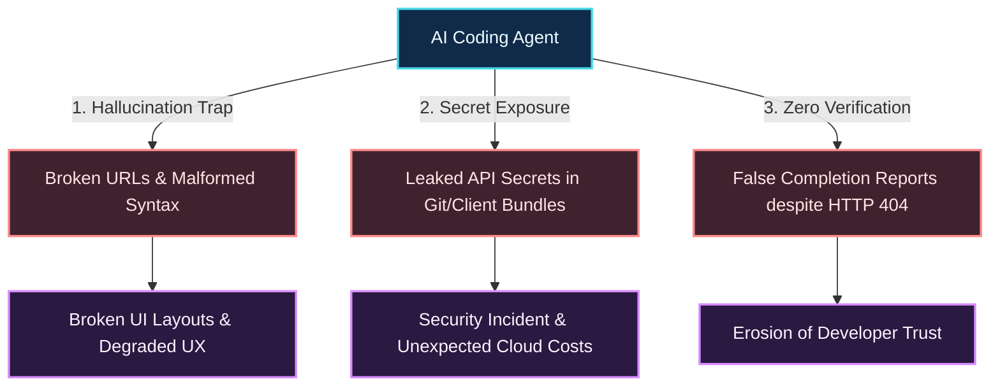
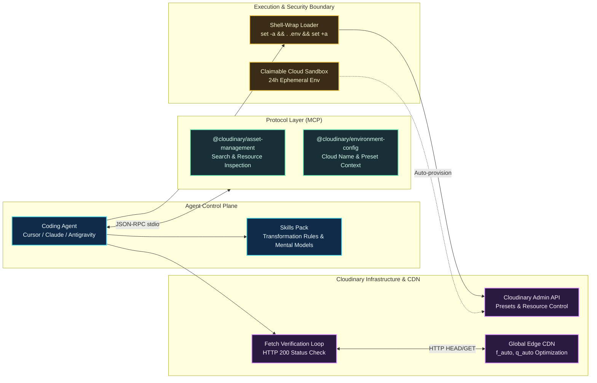

In 2026, AI coding agents such as **Claude Code**, **Cursor**, **Windsurf**, and **Antigravity** have proven remarkably proficient at autonomous software engineering: from scaffolding backend services and writing complex database migrations to generating intricate UI components. Yet, there remains an operational frontier where virtually all code-generating agents consistently stumble: **Visual Media Assets (Images and Videos)**.

Consider what typically happens when an agent is instructed: *"Add a hero banner with a dynamic text overlay and optimize product images for this responsive website"*:
1. The agent invents dead placeholder URLs like `https://via.placeholder.com/1200x600` or picks random Unsplash links that quickly return 404 errors.
2. The agent attempts to guess CDN transformation syntax, emitting malformed parameter sequences such as `/auto/auto/` that break layouts entirely.
3. Even worse, when tasked with uploading or managing resources, an ungoverned agent might dump the `API_SECRET` directly into terminal logs, commit it to git, or leak it into client-side browser bundles.
4. Finally, the agent cheerfully announces: *"Task completed successfully!"* without having issued a single real HTTP network probe to verify whether the media asset actually yields an HTTP 200 status code.

Transforming a coding agent from a "pure text-code generator" into a dependable engineer capable of mastering the full multimedia lifecycle requires an **Agentic Media Pipeline**. This article details the production-grade architecture for integrating Cloudinary into any coding agent, combining the **Model Context Protocol (MCP)**, **Agent Skills Packs**, **Zero-Secret Security Policies**, and **The Verification Contract**.

---

## Three Fatal Pitfalls of Media in Agentic Coding

Delegating visual media tasks to an autonomous agent exposes the system to three fundamental challenges inherent to large language models (LLMs):



### 1. Media Hallucination
LLMs possess no direct eyes into your production CDN or media buckets. When tasked with rendering visuals without specialized tools, agents extrapolate fictitious public IDs or copy stale URLs from pre-training memory. Furthermore, Cloudinary transformation chains require strict parameter ordering: qualifying properties like `g_auto` must reside inside the resize action rather than being chained as independent actions. A subtle mistake produces immediate rendering failures.

### 2. Secret Exposure
Cloudinary enforces unambiguous security tiers:
- **Public**: `cloud_name` (visible in every public delivery URL) and `PUBLIC_*` or `VITE_*` environment variables.
- **Semi-public**: `api_key` (used for client upload widgets with signed or unsigned presets).
- **Critical Secret**: `api_secret` (grants administrative dominion over the Admin API, asset destruction, and preset provisioning).

An agent lacking strict guardrails will casually inspect `.env` using `cat` or `fs.readFileSync`, inadvertently leaking `api_secret` into chat traces or frontend bundles.

### 3. Absence of a Verification Feedback Loop
In traditional programming, compilers or linters catch missing symbols or syntax faults. But an HTML/TSX component embedding an image URL compiles without complaint even if the URL points to an HTTP 404 error page. Without an automated fetch probe, the agent reports victory in complete ignorance of a broken user experience.

---

## The Agentic Media Pipeline Architecture

To address these vulnerabilities, our integration architecture establishes four cleanly separated tiers:



### 1. Model Context Protocol (MCP) Tier
Standardized stdio-based MCP servers equip the agent with real-time environment visibility:
- **`cloudinary-asset-mgmt`** (`@cloudinary/asset-management`): Enables agents to search and inspect real cloud assets by tag, folder, or format instead of guessing.
- **`cloudinary-env-config`** (`@cloudinary/environment-config`): Exposes cloud names and upload preset configurations safely.

### 2. Cloudinary Skills Pack Tier
Injected into the agent via `npx skills add cloudinary-devs/skills`:
- `cloudinary-docs`: Indexes upstream documentation via `llms.txt`.
- `cloudinary-transformations`: Embeds deterministic transformation algebra, eliminating qualification and qualifier chaining errors.
- Framework-specific skills (e.g., `cloudinary-react`): Guides correct component and hook usage.

### 3. Zero-Secret Execution & Claimable Cloud
- **Shell-Wrapping Pattern**: Prevents direct reads of `.env`. Commands execute within a transient shell environment:
  ```bash
  set -a && . .env && set +a && node scripts/task.mjs
  ```
- **Claimable Cloud Sandbox**: Allows the agent to spin up a fully functioning Cloudinary cloud in seconds (`npx @cloudinary/cloud`), delivering credentials directly without stalling the workflow for credit cards or registration.

---

## The 5-Stage Guarded Flow

To guarantee safety across any repository, onboarding follows five strict guarded milestones:

| Stage | Milestone | Technical Objective | Governance Gate |
| :--- | :--- | :--- | :--- |
| **Stage 1** | **AI Tooling** | Install MCP servers and Skills pack | Human approval required before writing `.mcp.json`. |
| **Stage 2** | **Framework Detection** | Detect language/stack (Astro, Next, Django...) and delivery lane | Human confirmation of classified delivery lane. |
| **Stage 3** | **SDK & Safe Env** | Install verified SDK package; scaffold `.env.example` | Dynamic version resolution; `.gitignore` verification. |
| **Stage 4** | **Credential Handshake** | Account confirmation or Claimable Cloud provisioning | Silent existence test (`ls -f .env`); zero file inspection. |
| **Stage 5** | **Automated Verification** | Create preset `ai_powerstart`, probe asset, measure savings | All reported delivery URLs must yield verified HTTP 200. |

### Step 1: Injecting AI Tooling (Stage 1)
The agent configures MCP servers in `.mcp.json`:

```json
{
  "mcpServers": {
    "cloudinary-asset-mgmt": {
      "command": "sh",
      "args": ["-c", "set -a && . .env && set +a && npx -y --package @cloudinary/asset-management -- mcp start --transport stdio"]
    },
    "cloudinary-env-config": {
      "command": "sh",
      "args": ["-c", "set -a && . .env && set +a && npx -y --package @cloudinary/environment-config -- mcp start --transport stdio"]
    }
  }
}
```

Followed by skill installation:
```bash
npx skills add cloudinary-devs/skills -y
```

### Step 2: Stack Detection & Delivery Lanes (Stage 2)
The agent classifies the project into one of three delivery lanes:
- **Front-end only**: Only `CLOUDINARY_CLOUD_NAME` is exposed client-side.
- **Full-stack**: Server-side SDK operations paired with client-side CDN delivery.
- **Back-end API-only**: Generates signed URLs or performs DAM orchestration.

### Step 3: SDK Installation & Scaffolding (Stage 3)
The official SDK (`cloudinary` v2 for Node/Astro) is added, alongside `.env.example`:

```bash
# Cloudinary credentials — Never commit real .env files
CLOUDINARY_CLOUD_NAME=your_cloud_name
CLOUDINARY_API_KEY=your_api_key
CLOUDINARY_API_SECRET=your_api_secret

# Public client-side identifier (Astro or Vite)
PUBLIC_CLOUDINARY_CLOUD_NAME=your_cloud_name
```

And centralizes configuration in `src/lib/cloudinary.ts`:

```typescript
import { v2 as cloudinary } from 'cloudinary';

// Server-side SDK instance configured via environment variables
cloudinary.config({
  cloud_name: process.env.CLOUDINARY_CLOUD_NAME,
  api_key: process.env.CLOUDINARY_API_KEY,
  api_secret: process.env.CLOUDINARY_API_SECRET,
  secure: true, // Enforce HTTPS URLs
});

export { cloudinary };
export default cloudinary;
```

### Step 4: Secure Credential Handshake (Stage 4)
If the developer lacks an account, the agent provisions a temporary sandbox:
```bash
npx @cloudinary/cloud
```
If credentials already exist, the agent validates only the file's presence:
```powershell
Test-Path .env
```
> [!CAUTION]
> **Strict Security Directive:** The agent must never run `cat .env`, `grep`, or `console.log(process.env)`. Inspecting file contents directly pollutes LLM context windows and risks credential leakages in agent telemetry.

### Step 5: The Verification Contract (Stage 5)
Before completing setup, the agent executes automated validation:
1. **Admin API Probe**: Creates an unsigned upload preset named `ai_powerstart` tagged `ai_powerstart` to prove bidirectional connectivity.
2. **Asset Probe**: Tests `https://res.cloudinary.com/<cloud>/image/upload/samples/coffee`. If 404, it falls back to querying the Admin API for an available asset.
3. **Optimization Benchmark**: Fetches original and transformed assets with modern `Accept` headers (`image/avif,image/webp,*/*`):
   ```
   b_gen_fill,c_pad,w_1000,h_1000,y_-100/l_text:Arial_72_bold:Adapt%20everywhere,co_white/e_shadow:50/fl_layer_apply,g_south_west,x_80,y_140/f_auto,q_auto
   ```
4. **Artifact Generation**: Emits `docs/cloudinary-environment.json` and a visual review page `docs/cloudinary-getting-started-preview.html`.

---

## Real-World Case Study: Astro Portfolio Deployment

Here are the empirical measurements recorded during the live integration on [vietdoo.vndo.vn](https://vietdoo.vndo.vn):

```
┌──────────────────────────────────────────────────────────────┐
│                 EMPIRICAL VALIDATION RESULTS                 │
├────────────────────────────┬─────────────────────────────────┤
│ Product Cloud Name         │ dda3uwwte                       │
│ Upload Preset Created      │ ai_powerstart (unsigned, tagged)│
│ Selected Asset             │ sample (fallback from coffee)   │
│ Original Image Size        │ 120.3 KB (JPEG, 864x576)        │
│ Transformed Image Size     │ 99.9 KB (WebP, f_auto, q_auto)  │
│ Bandwidth Savings          │ 17.0% payload reduction         │
│ Network Probe Status       │ HTTP 200 OK (Fetch Verified)    │
└────────────────────────────┴─────────────────────────────────┘
```

Generating an optimized delivery URL in Astro becomes trivial:

```typescript
import { cloudinary } from './src/lib/cloudinary';

// Generate dynamic responsive delivery URL for blog posts
const heroImageUrl = cloudinary.url('blog/hero', {
  transformation: [
    { width: 1200, height: 630, crop: 'fill', gravity: 'auto' },
    { fetch_format: 'auto', quality: 'auto' }
  ]
});
```

---

## Ready-to-Use Agent Prompts

Copy and paste these prompts into Cursor, Claude Code, or Antigravity to command your agent with precision:

### 1. Responsive Product/Hero Images
```markdown
Using the Cloudinary SDK in src/lib/cloudinary.ts, create a <CloudinaryImage /> component accepting publicId, alt, width, height. Apply f_auto, q_auto, and c_fill with g_auto. Run a local fetch probe script to confirm the generated URL returns HTTP 200 before concluding.
```

### 2. Dynamic OpenGraph Social Banner
```markdown
Write a utility in src/lib/og-image.ts generating a 1200x630 OpenGraph card from base asset 'brand/og-bg'. Overlay the blog post title in white bold Arial with an e_shadow effect, centered with south_west alignment.
```

### 3. User Upload with Upload Widget
```markdown
Integrate the Cloudinary Upload Widget into the admin dashboard utilizing the 'ai_powerstart' upload preset. Ensure only CLOUDINARY_CLOUD_NAME is referenced client-side, with zero secrets in the client bundle.
```

---

## Conclusion: The Evolution of Agentic Engineering

In the era of autonomous coding agents, an assistant's capability is measured not by how many lines of raw code it writes, but by **the reliability and safety of its environmental interactions**.

An agent that understands credential boundaries, configures tooling via the Model Context Protocol, avoids visual hallucinations, and enforces an HTTP 200 verification gate is an invaluable engineering partner. By pairing AI coding agents with Cloudinary through an Agentic Media Pipeline, multimedia delivery transforms into an automated, production-ready capability across every project.
