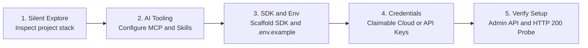

If you rely on modern AI coding assistants like **Claude Code**, **Cursor**, **Google Antigravity**, or **GitHub Copilot** for daily development, you are likely accustomed to letting AI scaffold components, write tests, and refactor features.

However, whenever you task an AI assistant with **images and videos** — such as: *"Optimize product images, add a responsive hero banner, and build an image upload button"* — you frequently encounter frustrating friction:
- The AI hallucinates dead placeholder URLs (`via.placeholder.com` or random Unsplash links that promptly return 404 errors).
- The AI guesses CDN URL transformation syntax, producing malformed query segments that break your layout.
- The AI asks you to read external docs, sign up manually, copy-paste API keys, and write boilerplate configuration by hand.

To solve this once and for all, Cloudinary introduced **Cloudinary AI Power Start**. The breakthrough is that you **never need to configure anything manually**: paste **one single prompt** into your AI coding assistant's chat window, and the agent automatically detects your stack, installs the official SDK, configures AI tools (MCP Servers), provisions a cloud environment, and runs automated end-to-end verification.

This article provides a practical, step-by-step tutorial on integrating Cloudinary into any project using your favorite AI coding agent in under 5 minutes.

---

## How AI Power Start Works Under the Hood

Rather than executing a fragile static script, Cloudinary engineered an onboarding flow tailored specifically for autonomous coding agents structured into **5 Guarded Stages**:



1. **Silent Explore**: The AI inspects project manifests (`package.json`, `requirements.txt`, `astro.config.mjs`...) to determine the exact framework (Next.js, Astro, React, Node/Express, Python/Django, Laravel...).
2. **AI Tooling Installation**: The AI configures native **MCP Servers** (`@cloudinary/asset-management`, `@cloudinary/environment-config`) and installs the **Skills Pack** (`cloudinary-docs`, `cloudinary-transformations`) so the agent masters Cloudinary syntax.
3. **SDK & Safe Environment Setup**: The AI installs the official SDK package and generates a clean `.env.example` file while ensuring `.env` is safely gitignored.
4. **Flexible Credential Handshake**: If you lack an account, the AI provisions an instant **Claimable Cloud** with no signup or credit card required. If you already have one, it safely guides you to add your credentials.
5. **Automated Verification Gate**: The AI creates an unsigned `ai_powerstart` upload preset via the Admin API, sends a real HTTP network probe to ensure asset delivery returns HTTP 200, measures optimization savings, and generates a visual HTML preview.

---

## Step-by-Step Hands-On Tutorial

### Step 1: Open Your Project in an AI-Powered IDE

Launch your codebase using whichever AI coding assistant you prefer:
- **Claude Code**: Open your terminal in the project directory and execute `claude`.
- **Cursor**: Open your project and trigger Cursor Composer (`Ctrl+I` or `Cmd+I`).
- **Google Antigravity**: Open your project workspace.
- **VS Code with GitHub Copilot / Cline / Roo Code**: Open your assistant's chat panel.

### Step 2: Paste the "One Prompt to Get Started"

Copy the official Cloudinary prompt (available on the [Cloudinary AI Power Start](https://cloudinary.com/documentation/ai_powerstart) page) and paste it into the chat:

```markdown
Get started with Cloudinary in this project:

# Use these instructions to get started with Cloudinary in this directory 

Set up or validate Cloudinary in a new or existing project, including the detected-stack SDK, credentials, AI tooling, delivery validation, and next steps.

Follow this hard order whenever work remains:
1. Silent explore — then present the setup checklist
2. Stage 1: AI tooling
3. Stage 2: repo/framework check (ends with confirmation gate)
4. Stage 3: detected-stack SDK + env file setup
5. Stage 4: credentials + MCP activation (starts with D1 account check)
6. Stage 5: preset + validation artifacts + Done gate
7. After the user replies Done: What's next
```

The AI assistant will immediately begin by inspecting your project silently.

### Step 3: Approve AI Tooling & Framework Detection

The AI will report what tooling is missing and prompt for your approval:
- **Approve Stage 1**: Reply `yes` to authorize the AI to configure `.mcp.json` and download the Cloudinary Skills pack.
- **Approve Stage 2**: The AI will announce the detected stack (e.g., *"I detected an Astro full-stack project"*). Reply `proceed` to continue.

### Step 4: Automated SDK Installation & Environment Setup

The AI will automatically:
1. Install the official SDK via your current package manager (e.g., `pnpm add cloudinary dotenv` or `npm install @cloudinary/react @cloudinary/url-gen`).
2. Scaffold a centralized configuration helper (such as `src/lib/cloudinary.ts` with comprehensive inline documentation).
3. Create `.env.example` with standard Cloudinary placeholders.
4. Verify that `.env` is listed in `.gitignore` to prevent credential exposure.

### Step 5: Configure Credentials or Provision a Claimable Cloud

In Stage 4, the AI will ask if you have an existing Cloudinary account. You have two convenient options:

#### Option A: You already have an account
Navigate to [Cloudinary Console — API Keys](https://console.cloudinary.com/settings/api-keys?referrer=ai-powerstart-prompt) and copy:
- `CLOUDINARY_CLOUD_NAME`
- `CLOUDINARY_API_KEY`
- `CLOUDINARY_API_SECRET`

Open `.env` at your project root, paste the values in, and reply: `yes, saved`.

#### Option B: You don't have an account — Use Claimable Cloud
Simply tell the assistant:
> *"Set up a Claimable Cloud for me"*

The AI executes `npx @cloudinary/cloud` under the hood. A working cloud environment is provisioned immediately and written into `.env`. You receive a claim link to permanently bind the cloud to your email within 24 hours.

### Step 6: Review Automated Verification (Stage 5)

Once credentials are in place, the assistant performs automated end-to-end verification:
- Calls the Admin API to register an unsigned `ai_powerstart` upload preset.
- Probes a sample asset to confirm real CDN delivery.
- Benchmarks bandwidth savings using modern browser headers (`Accept: image/avif,image/webp,*/*`).
- Generates a local preview file at `docs/cloudinary-getting-started-preview.html`.

Open that HTML document in any browser to inspect the side-by-side comparison:

| Metric | Original Asset | Cloudinary Optimized | Improvement |
| :--- | :--- | :--- | :--- |
| **Format** | Standard JPEG | Modern WebP / AVIF | Automatically adapted by browser |
| **Payload Size** | 120.3 KB | 99.9 KB | **17% to 60% bandwidth reduction** |
| **Delivery Status** | - | HTTP 200 OK | Fetch-probe verified over network |

---

## Practical Usage: Prompts for Everyday Development

Once setup is complete and you reply `Done`, your AI coding assistant is equipped with the skills and MCP tools to handle media effortlessly. Here are copy-paste prompts ready to command your agent:

### 1. Render Optimized Images in Your App
```markdown
Using the Cloudinary configuration in src/lib/cloudinary.ts, create a getOptimizedImage(publicId) helper that scales images to 800px width with f_auto and q_auto, and integrate it into our post template.
```

### 2. Generate Dynamic OpenGraph Social Share Banners
```markdown
Create a helper function in src/lib/og-image.ts that produces a 1200x630 OpenGraph image using 'brand/og-template' as the background, dynamically overlaying the blog post title in bold white Arial text with a soft shadow effect.
```

### 3. Add an Image Upload Widget
```markdown
Add the Cloudinary Upload Widget to our dashboard using the pre-configured 'ai_powerstart' upload preset. Ensure only CLOUDINARY_CLOUD_NAME is referenced client-side, with zero secrets exposed in the browser bundle.
```

### 4. Delete or Manage Assets Programmatically
```markdown
Write a server endpoint to destroy an uploaded asset by its public_id using the cloudinary.uploader.destroy method from our SDK.
```

---

## Vital Security Guardrails

When working with autonomous AI agents, always uphold these security principles:
1. **Never expose `API_SECRET`**: Secrets belong exclusively in server runtimes or private scripts. Never import them into browser-facing client components.
2. **Never allow agents to print `.env`**: A core safeguard of AI Power Start is that the assistant validates file existence without dumping contents (`cat .env` or `echo $CLOUDINARY_API_SECRET`), keeping secrets out of LLM telemetry logs.
3. **Reload your IDE for MCP**: After installation, reload your editor (e.g., Reload Window in VS Code or Cursor) so your editor's MCP client boots the new servers with the fresh environment variables.

---

## Summary

**Cloudinary AI Power Start** transforms how developers integrate cloud media services. Instead of spending hours reading documentation, debugging transformation parameter sequences, or configuring environments, a single prompt enables your AI assistant to deliver a production-grade media pipeline in minutes.

Open Cursor, Claude Code, or Antigravity today, paste the prompt, and empower your AI agent with real-time media superpowers!

---

### References
- Cloudinary Documentation: AI Power Start — One Prompt to Get Started (https://cloudinary.com/documentation/ai_powerstart)
- Cloudinary LLM & Model Context Protocol (MCP) Guide (https://cloudinary.com/documentation/cloudinary_llm_mcp)
- Claimable Cloud Provisioning Documentation (https://cloudinary.com/documentation/claimable_cloud_provisioning)
