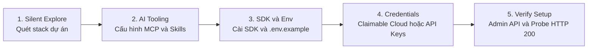

Trong workflow phát triển phần mềm hiện đại, các AI coding assistant như **Claude Code**, **Cursor**, **Google Antigravity** hay **GitHub Copilot** đã đảm nhận rất tốt việc generate boilerplate, refactor module hay sinh schema database. Tuy nhiên, khi chuyển sang bài toán **quản lý và tối ưu hóa visual media (hình ảnh & video)** — chẳng hạn yêu cầu agent dựng responsive banner, thiết lập OpenGraph card động hoặc cấu hình upload pipeline — chúng ta thường gặp phải những điểm gãy cố hữu:

- **Media URL Hallucination**: Agent thường tự sinh các URL tĩnh không tồn tại (`via.placeholder.com` hoặc link Unsplash ngẫu nhiên sẽ sớm trả về HTTP 404).
- **Transformation Syntax Error**: Cú pháp biến đổi ảnh trên CDN của Cloudinary đòi hỏi parameter chaining rất chặt chẽ. Khi agent tự phỏng đoán, nó rất dễ tách rời các qualifier (như đặt `g_auto` bên ngoài action resize), dẫn đến URL bị lỗi lặp `/auto/auto/` và làm vỡ layout.
- **Rò rỉ Secret Key**: Nếu không có guardrail rõ ràng, agent có thể đọc trực tiếp file `.env`, vô tình in `API_SECRET` vào terminal log, đẩy lên git commit, hoặc đưa nhầm vào client bundle của frontend.
- **Thiếu Feedback Loop xác thực**: Agent thường thông báo hoàn thành task dựa trên cú pháp code thuần túy, hoàn toàn không có bước gửi network probe để kiểm tra asset thực sự có trả về HTTP 200 hay không.

Để chuẩn hóa toàn bộ quy trình này, Cloudinary phát hành giải pháp **Cloudinary AI Power Start**. Đây là một framework onboarding dạng stage-based, cho phép bạn đưa toàn bộ năng lực xử lý media chuẩn production vào codebase chỉ thông qua **một câu prompt duy nhất**. Agent sẽ tự động phân tích stack dự án, cấu hình Model Context Protocol (MCP), cài đặt SDK, khởi tạo cloud sandbox và chạy kiểm thử tự động từ đầu đến cuối.

---

## Cơ chế hoạt động của AI Power Start

Thay vì thực thi một script cài đặt cố định, AI Power Start vận hành như một state machine với **5 chặng kiểm soát có bảo vệ (Guarded Stages)**:



1. **Silent Explore**: Agent quét ngầm các manifest (`package.json`, `requirements.txt`, `astro.config.mjs`...) để xác định framework (Next.js, Astro, React, Express, Django...) và phân loại **Delivery Lane** (Frontend-only, Full-stack hay Backend API).
2. **AI Tooling Plane**: Agent cấu hình hai máy chủ MCP chuẩn (`@cloudinary/asset-management` và `@cloudinary/environment-config`), đồng thời nạp bộ Skills chuyên biệt (`cloudinary-docs`, `cloudinary-transformations`) vào agent runtime.
3. **SDK Scaffolding**: Cài đặt package SDK tương thích trực tiếp từ package manager hiện hành, khởi tạo module config trung tâm và tạo file `.env.example`.
4. **Credential Handshake & Claimable Cloud**: Nếu developer chưa có tài khoản, agent có thể tự khởi tạo một môi trường sandbox tạm thời (Claimable Cloud) mà không cần đăng ký tài khoản trước.
5. **Verification Gate**: Agent gọi Admin API tạo unsigned upload preset `ai_powerstart`, probe delivery URL thực tế qua mạng, đo lường bandwidth savings và xuất artifact preview trực quan.

---

## Hướng dẫn triển khai từng bước (Hands-on Tutorial)

### Bước 1: Khởi động Workspace trong AI IDE

Mở dự án của bạn trên môi trường AI ưa thích:
- **Claude Code**: Chạy `claude` tại thư mục root của dự án.
- **Cursor**: Mở project và kích hoạt Composer (`Ctrl+I` hoặc `Cmd+I`).
- **Google Antigravity**: Mở workspace active của dự án.
- **VS Code / Copilot / Cline**: Mở panel chat của agent.

### Bước 2: Kích hoạt AI Power Start Prompt

Copy toàn bộ prompt tiêu chuẩn từ tài liệu chính thức của Cloudinary ([Cloudinary AI Power Start](https://cloudinary.com/documentation/ai_powerstart)) và gửi vào khung chat của agent:

```markdown
Get started with Cloudinary in this project:

# Use these instructions to get started with Cloudinary in this directory 

Set up or validate Cloudinary in a new or existing project, including the detected-stack SDK, credentials, AI tooling, delivery validation, and next steps.

Follow this hard order whenever work remains:
1. Silent explore — then present the setup checklist
2. Stage 1: AI tooling
3. Stage 2: repo/framework check (ends with confirmation gate)
4. Stage 3: detected-stack SDK + env file setup
5. Stage 4: credentials + MCP activation (starts with D1 account check)
6. Stage 5: preset + validation artifacts + Done gate
7. After the user replies Done: What's next
```

Ngay sau khi nhận lệnh, agent sẽ chủ động quét cấu trúc repo và xuất checklist 5 giai đoạn.

### Bước 3: Phê duyệt AI Tooling và Xác nhận Stack

Quy trình onboarding tuân thủ nguyên tắc human-in-the-loop:
- **Stage 1 Gate**: Agent phát hiện các tooling còn thiếu và yêu cầu cấp quyền. Bạn trả lời `yes` để agent tạo file `.mcp.json` và cài đặt các skills cần thiết:
  ```json
  {
    "mcpServers": {
      "cloudinary-asset-mgmt": {
        "command": "sh",
        "args": ["-c", "set -a && . .env && set +a && npx -y --package @cloudinary/asset-management -- mcp start --transport stdio"]
      },
      "cloudinary-env-config": {
        "command": "sh",
        "args": ["-c", "set -a && . .env && set +a && npx -y --package @cloudinary/environment-config -- mcp start --transport stdio"]
      }
    }
  }
  ```
- **Stage 2 Gate**: Agent xác nhận framework và delivery lane (ví dụ: *Astro full-stack*). Bạn phản hồi `proceed` để tiếp tục.

### Bước 4: Thiết lập SDK và Module Cấu hình

Agent tự động thực thi cài đặt thư viện SDK và khởi tạo module wrapper:
- Với Node.js / Astro: chạy `pnpm add cloudinary dotenv` (hoặc npm/yarn tương ứng).
- Khởi tạo file cấu hình server-side (ví dụ `src/lib/cloudinary.ts`):
  ```typescript
  import { v2 as cloudinary } from 'cloudinary';

  cloudinary.config({
    cloud_name: process.env.CLOUDINARY_CLOUD_NAME,
    api_key: process.env.CLOUDINARY_API_KEY,
    api_secret: process.env.CLOUDINARY_API_SECRET,
    secure: true,
  });

  export { cloudinary };
  export default cloudinary;
  ```
- Sinh file `.env.example` với đầy đủ placeholder và xác nhận `.env` đã nằm trong `.gitignore`.

### Bước 5: Thiết lập Credentials an toàn hoặc dùng Claimable Cloud

Tại Stage 4, bạn có hai lựa chọn linh hoạt:

#### Lựa chọn 1: Sử dụng tài khoản có sẵn
Truy cập [Cloudinary Console — API Keys](https://console.cloudinary.com/settings/api-keys?referrer=ai-powerstart-prompt), copy 3 giá trị `CLOUDINARY_CLOUD_NAME`, `CLOUDINARY_API_KEY`, `CLOUDINARY_API_SECRET` và điền vào `.env`. Sau đó trả lời agent: `yes, saved`.

#### Lựa chọn 2: Cấp phát Claimable Cloud (Zero-Signup Path)
Nếu chưa có tài khoản hoặc muốn test nhanh trong môi trường cô lập, bạn chỉ cần nhắn:
> *"Set up a Claimable Cloud for me"*

Agent sẽ gọi lệnh CLI `npx @cloudinary/cloud`. Một cloud environment thực tế sẽ được provision tức thì, ghi `CLOUDINARY_URL` vào `.env`, và trả về một claim link. Bạn có 24 giờ để liên kết cloud này với email cá nhân nếu muốn giữ lại tài nguyên sau đó.

> [!IMPORTANT]
> **Zero-Secret Guardrail**: Agent chỉ kiểm tra sự tồn tại của file bằng lệnh như `Test-Path .env`. Agent tuyệt đối không được phép chạy `cat .env`, `grep` hay in giá trị secret ra console log nhằm tránh việc lộ credentials vào telemetry hoặc context window của LLM.

### Bước 6: Thẩm định Tự động qua Verification Gate (Stage 5)

Ngay sau khi có credentials, agent tiến hành chuỗi kiểm thử tự động:
1. **Admin API Handshake**: Đăng ký unsigned upload preset `ai_powerstart` có tag `ai_powerstart` để xác nhận quyền ghi và khả năng kết nối hai chiều.
2. **Asset Probe**: Gửi request tới `samples/coffee`. Nếu asset này không khả dụng, agent tự động query qua Admin API để chọn một asset hợp lệ sẵn có trong cloud.
3. **Format & Compression Benchmark**: Fetch asset với header `Accept: image/avif,image/webp,*/*` để đo lường hiệu năng của chuỗi tối ưu hóa:
   ```
   b_gen_fill,c_pad,w_1000,h_1000,y_-100/l_text:Arial_72_bold:Adapt%20everywhere,co_white/e_shadow:50/fl_layer_apply,g_south_west,x_80,y_140/f_auto,q_auto
   ```
4. **Sinh Verification Artifacts**:
   - `docs/cloudinary-environment.json`: Lưu trữ metadata kỹ thuật (cloud name, preset, measurements) hoàn toàn không chứa secret.
   - `docs/cloudinary-getting-started-preview.html`: Trang HTML so sánh visual side-by-side giữa asset gốc và asset tối ưu.

Kết quả đo lường thực tế trên dự án:

| Tiêu chí | Asset Gốc | Qua Cloudinary CDN | Kết quả thực tế |
| :--- | :--- | :--- | :--- |
| **Format** | JPEG | WebP / AVIF | Tự động negotiate theo client header |
| **Payload** | 120.3 KB | 99.9 KB | **Giảm 17.0% dung lượng truyền tải** |
| **Delivery URL** | - | HTTP 200 OK | Xác thực thành công qua network probe |

Sau khi review file preview và xác nhận mọi thứ hoạt động, bạn chỉ cần gõ `Done` để kết thúc onboarding.

---

## Các Prompt thực chiến sau khi tích hợp

Sau khi hoàn tất quá trình thiết lập, AI coding agent đã có đầy đủ context về SDK và MCP tools. Bạn có thể sử dụng các câu lệnh sau trong công việc hàng ngày:

### 1. Tự động tối ưu hình ảnh trong template UI
```markdown
Dựa vào module src/lib/cloudinary.ts, hãy viết một helper function sinh delivery URL cho ảnh bài viết với chiều rộng tối đa 1200px, tự động crop căn giữa đối tượng (c_fill, g_auto), bật f_auto và q_auto. Hãy chạy một script kiểm tra fetch probe URL trước khi đưa vào component.
```

### 2. Tạo dynamic OpenGraph social share card
```markdown
Tạo một utility trong src/lib/og-image.ts nhận vào title bài viết, sử dụng asset nền 'brand/og-template' và tự động overlay text tiêu đề bằng phông Arial bold màu trắng, có drop shadow nhẹ và căn lề dưới bên trái.
```

### 3. Tích hợp Cloudinary Upload Widget
```markdown
Tích hợp Cloudinary Upload Widget vào trang admin cho phép người dùng tải ảnh đại diện lên. Sử dụng unsigned preset 'ai_powerstart' đã cấu hình. Lưu ý chỉ truyền cloud name ở client-side, không expose bất kỳ secret nào.
```

### 4. Quản lý và xóa asset qua Server API
```markdown
Xây dựng một API route ở backend nhận public_id và gọi hàm cloudinary.uploader.destroy để xóa asset tương ứng trên Cloudinary khi bài viết bị xóa.
```

---

## Nguyên tắc bảo mật cốt lõi khi làm việc với AI Agent

1. **Ranh giới Client vs Server**: `CLOUDINARY_API_SECRET` chỉ tồn tại ở runtime server-side hoặc trong các build/admin scripts. Phía frontend chỉ được phép tiếp cận `CLOUDINARY_CLOUD_NAME` (hoặc các biến có tiền tố `PUBLIC_*` / `VITE_*`).
2. **Ngăn chặn Context Leakage**: Luôn nạp biến môi trường bằng kỹ thuật shell-wrap (`set -a && . .env && set +a`) hoặc qua file config của IDE, không truyền secret trực tiếp qua prompt của LLM.
3. **Kích hoạt MCP sau cài đặt**: Nếu agent chưa đọc được assets ngay sau khi cấu hình, hãy reload lại cửa sổ IDE để client MCP nạp lại environment variables mới từ `.env`.

---

## Tổng kết

Tích hợp media vào ứng dụng hiện đại không chỉ là việc chèn một thẻ ``, mà là xây dựng một pipeline hoàn chỉnh: từ định dạng thích ứng, nén tối ưu, CDN delivery cho đến bảo mật credentials.

Với **Cloudinary AI Power Start**, khoảng cách giữa một ý tưởng và một media pipeline chuẩn production được rút ngắn xuống chỉ còn một câu lệnh prompt. Thay vì tiêu tốn hàng giờ đọc tài liệu và debug cấu hình thủ công, developer có thể để AI coding agent tự động hóa toàn bộ quá trình một cách chuẩn xác, an toàn và có thể kiểm chứng được ngay lập tức.

---

### Tài liệu tham khảo
- Cloudinary Documentation: AI Power Start Guide (https://cloudinary.com/documentation/ai_powerstart)
- Model Context Protocol (MCP) in Cloudinary (https://cloudinary.com/documentation/cloudinary_llm_mcp)
- Claimable Cloud Provisioning Protocol (https://cloudinary.com/documentation/claimable_cloud_provisioning)
