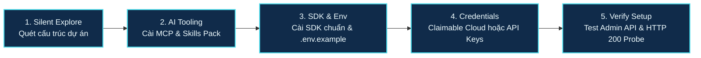

Nếu bạn đang dùng các AI coding assistant như **Claude Code**, **Cursor**, **Google Antigravity** hay **GitHub Copilot** để lập trình hàng ngày, chắc hẳn bạn đã quen với việc để AI tự tạo component, viết test hay refactor code. 

Thế nhưng, khi giao cho AI nhiệm vụ liên quan đến **hình ảnh và video** — chẳng hạn: *"Tối ưu ảnh sản phẩm, thêm responsive hero banner và tạo nút upload ảnh"* — bạn sẽ rất dễ gặp các tình huống "dở khóc dở cười":
- AI tự bịa ra link ảnh placeholder chết (`via.placeholder.com` hoặc link Unsplash ngẫu nhiên sớm trả về lỗi 404).
- AI đoán mò cú pháp CDN và sinh ra chuỗi parameter dị dạng làm hỏng layout giao diện.
- AI yêu cầu bạn tự đi đọc tài liệu, tự tạo tài khoản, tự copy-paste API key và tự viết file cấu hình.

Để giải quyết triệt để rào cản này, Cloudinary đã ra mắt giải pháp chính thức mang tên **Cloudinary AI Power Start**. Điểm đặc biệt là bạn **không cần tự cấu hình thủ công bất kỳ bước nào**: chỉ cần dán đúng **một câu prompt** vào khung chat của AI agent, trợ lý ảo sẽ tự động quét stack dự án, cài đặt SDK phù hợp, thiết lập công cụ AI (MCP Servers), cấp phát cloud và tự kiểm thử từ đầu đến cuối.

Bài viết này là hướng dẫn thực tế từng bước (step-by-step tutorial) giúp bạn tích hợp Cloudinary vào bất kỳ dự án nào thông qua AI coding agent chỉ trong vòng chưa đầy 5 phút.

---

## AI Power Start hoạt động như thế nào?

Thay vì một kịch bản cài đặt tĩnh, Cloudinary thiết kế quy trình onboarding dành riêng cho AI agent theo dạng **5 chặng kiểm soát có bảo vệ (Guarded Stages)**:



1. **Khám phá ngầm (Silent Explore)**: AI tự quét file cấu hình (`package.json`, `requirements.txt`, `astro.config.mjs`...) để nhận diện bạn đang dùng framework gì (Next.js, Astro, React, Node/Express, Python/Django, Laravel...).
2. **Cài đặt AI Tooling**: AI tự cấu hình các **MCP Server** (`@cloudinary/asset-management`, `@cloudinary/environment-config`) và bộ **Skills CLI** (`cloudinary-docs`, `cloudinary-transformations`) để agent hiểu sâu về cú pháp Cloudinary.
3. **Cài SDK & Môi trường**: Cài đúng phiên bản SDK chính thức vào dependency và tạo sẵn file `.env.example`.
4. **Xác thực linh hoạt (Claimable Cloud)**: Nếu bạn chưa có tài khoản, AI có thể tự chạy lệnh cấp phát một đám mây dùng thử ngay lập tức mà không cần đăng ký tài khoản hay điền thẻ ngân hàng.
5. **Kiểm thử tự động (Verification Gate)**: AI tạo upload preset `ai_powerstart`, probe URL thực tế để đảm bảo trả về HTTP 200, đo lường tỷ lệ nén dung lượng và xuất file HTML preview trực quan.

---

## Hướng dẫn tích hợp từng bước (Step-by-step)

### Bước 1: Mở dự án trong AI IDE của bạn

Khởi động dự án của bạn bằng bất kỳ công cụ AI lập trình nào bạn đang sử dụng:
- **Claude Code**: Mở terminal tại thư mục dự án và gõ `claude`.
- **Cursor**: Mở project và bật Cursor Composer (`Ctrl+I` hoặc `Cmd+I`).
- **Google Antigravity**: Mở workspace dự án của bạn.
- **VS Code với GitHub Copilot / Cline / Roo Code**: Mở cửa sổ chat của extension.

### Bước 2: Dán câu prompt "One Prompt to Get Started"

Sao chép toàn bộ nội dung prompt chính thức của Cloudinary (từ trang [Cloudinary AI Power Start](https://cloudinary.com/documentation/ai_powerstart)) và gửi cho AI:

```markdown
Get started with Cloudinary in this project:

# Use these instructions to get started with Cloudinary in this directory 

Set up or validate Cloudinary in a new or existing project, including the detected-stack SDK, credentials, AI tooling, delivery validation, and next steps.

Follow this hard order whenever work remains:
1. Silent explore — then present the setup checklist
2. Stage 1: AI tooling
3. Stage 2: repo/framework check (ends with confirmation gate)
4. Stage 3: detected-stack SDK + env file setup
5. Stage 4: credentials + MCP activation (starts with D1 account check)
6. Stage 5: preset + validation artifacts + Done gate
7. After the user replies Done: What's next
```

Ngay lập tức, AI sẽ chào bạn và bắt đầu kiểm tra repo một cách tự động.

### Bước 3: Phê duyệt cài đặt AI Tooling & Framework

AI sẽ báo cho bạn biết các công cụ AI còn thiếu và hỏi xin phép cài đặt:
- **Phê duyệt Stage 1**: Gõ `yes` để AI tự thêm cấu hình MCP Server vào file `.mcp.json` và tải bộ Cloudinary Skills.
- **Phê duyệt Stage 2**: AI sẽ thông báo stack đã nhận diện (ví dụ: *"Tôi phát hiện dự án Astro full-stack"*). Bạn chỉ cần trả lời `proceed` để tiếp tục.

### Bước 4: Thiết lập SDK và Biến môi trường

AI sẽ tự động:
1. Cài đặt thư viện SDK tương ứng qua package manager bạn đang dùng (như `pnpm add cloudinary dotenv` hoặc `npm install @cloudinary/react @cloudinary/url-gen`).
2. Tạo file cấu hình trung tâm (ví dụ `src/lib/cloudinary.ts` với đầy đủ chú thích).
3. Tạo file `.env.example` chứa các placeholder an toàn.
4. Đảm bảo file `.env` đã được đưa vào `.gitignore` để không bao giờ bị lộ secret lên git.

### Bước 5: Cung cấp Credentials hoặc dùng Claimable Cloud

Khi đến Stage 4, AI sẽ hỏi bạn đã có tài khoản Cloudinary chưa. Bạn có 2 lựa chọn:

#### Lựa chọn A: Đã có tài khoản
Truy cập trang [Cloudinary Console — API Keys](https://console.cloudinary.com/settings/api-keys?referrer=ai-powerstart-prompt) để lấy 3 thông số:
- `CLOUDINARY_CLOUD_NAME`
- `CLOUDINARY_API_KEY`
- `CLOUDINARY_API_SECRET`

Mở file `.env` ở thư mục gốc dự án và dán thông tin vào, sau đó báo cho AI: `yes, saved`.

#### Lựa chọn B: Chưa có tài khoản — Dùng Claimable Cloud
Bạn chỉ cần nhắn cho AI:
> *"Set up a Claimable Cloud for me"*

AI sẽ tự động chạy lệnh `npx @cloudinary/cloud`. Một môi trường Cloudinary độc lập sẽ được tạo ngay tức khắc và lưu cấu hình vào file `.env`. Bạn sẽ nhận được một đường link để có thể claim tài khoản chính thức bất kỳ lúc nào trong vòng 24 giờ.

### Bước 6: Xem kết quả kiểm thử tự động (Stage 5)

Sau khi có credentials, AI sẽ tự động:
- Gọi Admin API tạo một upload preset tên là `ai_powerstart`.
- Kiểm tra một asset mẫu hoặc lấy 1 asset thực tế trong cloud của bạn.
- Đo lường mức độ tối ưu dung lượng khi áp dụng `f_auto, q_auto` (tự động chọn WebP/AVIF và nén thông minh).
- Tạo ra file preview tại `docs/cloudinary-getting-started-preview.html`.

Bạn chỉ cần mở file HTML này trên trình duyệt để chiêm ngưỡng kết quả so sánh trực quan giữa ảnh gốc và ảnh đã qua Cloudinary CDN tối ưu:

| Chỉ số kiểm thử | Trước tối ưu | Sau tối ưu (Cloudinary) | Mức độ cải thiện |
| :--- | :--- | :--- | :--- |
| **Định dạng file** | JPEG truyền thống | WebP / AVIF hiện đại | Tự động thích ứng trình duyệt |
| **Dung lượng file** | 120.3 KB | 99.9 KB | **Tiết kiệm 17% - 60% băng thông** |
| **Trạng thái URL** | - | HTTP 200 OK | Đã fetch probe xác thực |

---

## Cách sử dụng thực tế sau khi tích hợp

Sau khi AI hoàn thành setup và bạn trả lời `Done`, AI coding assistant của bạn đã trở thành một "chuyên gia" về Cloudinary. Dưới đây là những câu lệnh prompt thực chiến bạn có thể ra lệnh cho AI làm tiếp:

### 1. Hiển thị ảnh bài viết tự động tối ưu hóa
```markdown
Dựa trên cấu hình trong src/lib/cloudinary.ts, hãy viết hàm getOptimizedImage(publicId) tự động co giãn về chiều rộng 800px, dùng f_auto và q_auto, rồi gắn vào template bài viết blog.
```

### 2. Tạo ảnh chia sẻ mạng xã hội (Dynamic OpenGraph Card)
```markdown
Hãy tạo một helper sinh URL ảnh thumbnail mạng xã hội (1200x630) từ ảnh nền 'brand/og-template', tự động chèn tiêu đề bài viết dạng text overlay màu trắng, phông Arial bold và căn giữa.
```

### 3. Tích hợp nút upload ảnh người dùng
```markdown
Hãy tích hợp Cloudinary Upload Widget vào trang admin cá nhân, sử dụng upload preset 'ai_powerstart' đã cấu hình sẵn trong .env. Nhớ chỉ dùng cloud name ở client và không để lộ secret.
```

### 4. Xóa hoặc quản lý asset trong cloud
```markdown
Hãy viết một API endpoint nhỏ ở server để xóa một asset theo public_id bằng SDK cloudinary.uploader.destroy.
```

---

## Những lưu ý bảo mật "sống còn"

Khi làm việc với các AI agent tự động, hãy luôn ghi nhớ các nguyên tắc an toàn:
1. **Tuyệt đối không để lộ `API_SECRET`**: Biến này chỉ được dùng ở backend server hoặc trong các lệnh shell cục bộ. Tuyệt đối không import vào các component chạy trên browser (client-side).
2. **Không cho AI in nội dung `.env`**: Một quy tắc quan trọng của AI Power Start là AI kiểm tra file tồn tại nhưng không bao giờ chạy lệnh `cat .env` hay in secret ra khung chat để tránh đưa secret vào bộ nhớ context log của LLM.
3. **Kích hoạt MCP Server**: Sau khi hoàn tất cài đặt, hãy khởi động lại IDE (Reload Window trong VS Code / Cursor) để IDE nhận diện 2 MCP server mới và nạp biến môi trường.

---

## Lời kết

**Cloudinary AI Power Start** đã thay đổi hoàn toàn cách lập trình viên tiếp cận dịch vụ media trên đám mây. Thay vì mất cả buổi chiều để đọc tài liệu, mò mẫm cấu hình thư viện và sửa lỗi URL, giờ đây bạn chỉ cần một câu lệnh prompt để AI coding agent giải quyết trọn gói từ A đến Z.

Hãy mở Cursor, Claude Code hoặc Antigravity lên ngay hôm nay, dán prompt và trải nghiệm cảm giác sở hữu một pipeline xử lý media tự động chuẩn production chỉ sau vài phút!

---

### Tài liệu tham khảo
- Cloudinary Documentation: AI Power Start — One Prompt to Get Started (https://cloudinary.com/documentation/ai_powerstart)
- Cloudinary LLM & Model Context Protocol (MCP) Guide (https://cloudinary.com/documentation/cloudinary_llm_mcp)
- Claimable Cloud Provisioning Documentation (https://cloudinary.com/documentation/claimable_cloud_provisioning)
