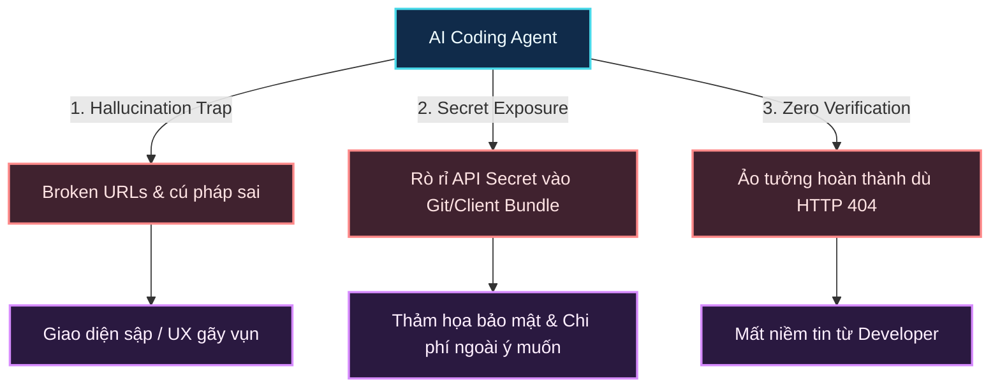
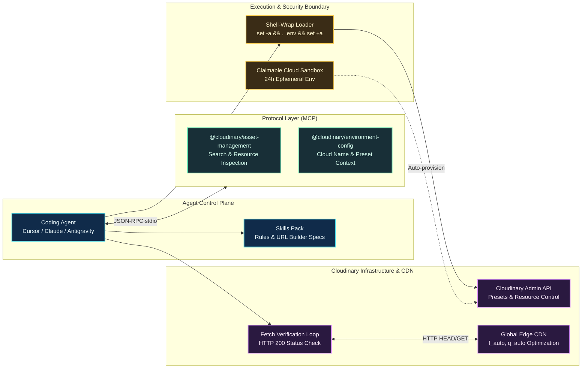

Năm 2026, các AI coding agent như **Claude Code**, **Cursor**, **Windsurf** hay **Antigravity** đã chứng minh năng lực vượt trội trong việc tự chủ viết code: từ scaffolding một backend service, tạo migration database, cho tới dựng giao diện UI component phức tạp. Nhưng có một ranh giới thực tế mà hầu hết các agent lập trình hiện nay đều vấp ngã một cách ngớ ngẩn: **Visual Media Assets (Hình ảnh & Video)**.

Hãy thử quan sát một agent khi được yêu cầu: *"Thêm một hero banner có text overlay và tối ưu ảnh sản phẩm cho trang web này"*. Điều gì thường xảy ra?
1. Agent tự "bịa" ra một URL placeholder chết kiểu `https://via.placeholder.com/1200x600` hoặc một link Unsplash ngẫu nhiên sẽ sớm trả về lỗi 404.
2. Agent cố đoán cú pháp URL transformation của các dịch vụ CDN và sinh ra chuỗi parameter dị dạng như `/auto/auto/` làm hỏng hoàn toàn layout.
3. Tệ hại hơn, khi được yêu cầu upload hay quản lý tài nguyên, agent có thể vô tư in toàn bộ `API_SECRET` vào terminal log, đẩy lên git commit, hoặc đưa nhầm secret key vào bundle JavaScript của trình duyệt.
4. Cuối cùng, agent tự tin tuyên bố: *"Tôi đã hoàn thành task!"* mà chưa từng thực hiện một HTTP request thực tế nào để kiểm chứng xem asset đó có thực sự tải được (HTTP 200) hay không.

Để biến coding agent từ một "kẻ sinh code văn bản thuần túy" thành một kỹ sư phần mềm thực thụ có khả năng làm chủ toàn bộ vòng đời truyền thông đa phương tiện, chúng ta cần một **Agentic Media Pipeline**. Bài viết này mổ xẻ kiến trúc chuẩn hóa để tích hợp Cloudinary vào bất kỳ coding agent nào, dựa trên sự kết hợp giữa **Model Context Protocol (MCP)**, **Agent Skills Pack**, **Zero-Secret Security Policy** và **The Verification Contract**.

---

## Ba rào cản chí mạng khi Coding Agent xử lý Media

Khi giao việc xử lý media cho một autonomous agent, hệ thống đối mặt với 3 thách thức thuộc về bản chất của mô hình ngôn ngữ lớn (LLM):



### 1. Ảo giác URL (Media Hallucination)
LLM không có "mắt" kết nối trực tiếp với CDN hay storage bucket của bạn. Khi cần hiển thị ảnh, nếu không có công cụ tra cứu, agent sẽ tự suy diễn ra một public ID hoặc copy một URL tĩnh đã hết hạn từ dữ liệu huấn luyện cũ. Thậm chí với Cloudinary, việc kết hợp các qualifier (như crop, gravity, text overlay, auto format) đòi hỏi thứ tự chuỗi URL rất khắt khe. Một sơ suất nhỏ như tách rời `g_auto` khỏi action resize sẽ tạo ra lỗi render ngay lập tức.

### 2. Nguy cơ phơi nhiễm bí mật (Secret Exposure)
Cloudinary phân chia ranh giới bảo mật rất rõ ràng:
- **Public**: `cloud_name` (công khai trong mọi delivery URL), `PUBLIC_*` hoặc `VITE_*` environment variables.
- **Semi-public**: `api_key` (dùng cho client upload widget có chữ ký hoặc unsigned preset).
- **Critical Secret**: `api_secret` (quyền tối thượng trên Admin API, xóa tài nguyên, tạo preset).

Một coding agent thiếu guardrail sẽ sẵn sàng đọc trực tiếp file `.env` bằng `cat` hay `fs.readFileSync`, và vô tình in `api_secret` vào chat log hoặc gộp vào code frontend.

### 3. Thiếu vòng lặp phản hồi thực tế (No Verification Loop)
Trong lập trình thông thường, compiler hoặc linter sẽ báo lỗi nếu bạn gõ sai tên biến. Nhưng với dynamic media URL, code HTML/TSX vẫn hợp lệ dù URL bên trong trỏ tới một trang 404! Nếu agent không có cơ chế tự kiểm chứng mạng (fetch probe), nó sẽ báo cáo task hoàn tất một cách mù quáng.

---

## Kiến trúc Agentic Media Pipeline

Để giải quyết triệt để 3 vấn đề trên, kiến trúc tích hợp bao gồm 4 tầng phân tách rõ ràng:



### 1. Tầng Model Context Protocol (MCP)
MCP cung cấp hai máy chủ công cụ tiêu chuẩn chạy qua `stdio`:
- **`cloudinary-asset-mgmt`** (`@cloudinary/asset-management`): Cho phép agent tìm kiếm asset thực tế trong cloud bằng tag, folder hoặc metadata, đọc thông tin width/height/format thay vì phải phỏng đoán.
- **`cloudinary-env-config`** (`@cloudinary/environment-config`): Cung cấp thông tin môi trường sản phẩm, cấu hình upload presets an toàn.

### 2. Tầng Cloudinary Skills Pack
Skills là bộ chỉ dẫn đặc tả (Domain Knowledge) được nạp trực tiếp vào system prompt của agent thông qua lệnh `npx skills add cloudinary-devs/skills`:
- `cloudinary-docs`: Giúp agent tra cứu trực tiếp tài liệu mới nhất thông qua `llms.txt`.
- `cloudinary-transformations`: Định hình tư duy ghép chuỗi biến đổi hình ảnh/video chuẩn xác tuyệt đối, tránh lỗi cú pháp qualifier.
- `cloudinary-react` / framework skills: Định chuẩn component và hook SDK.

### 3. Tầng Zero-Secret Execution & Claimable Cloud
- **Cơ chế Shell-Wrapping**: Agent không bao giờ dùng lệnh đọc trực tiếp file `.env`. Thay vào đó, agent thực thi các lệnh backend thông qua pattern cô lập:
  ```bash
  set -a && . .env && set +a && node scripts/task.mjs
  ```
- **Claimable Cloud Sandbox**: Tính năng đột phá cho phép agent tự khởi tạo một Cloudinary environment tạm thời có hạn dùng 24 giờ (`npx @cloudinary/cloud`) mà không cần con người phải dừng lại để đăng ký tài khoản hay quẹt thẻ tín dụng.

---

## Quy trình 5 bước Onboarding chuẩn hóa (The 5-Stage Guarded Flow)

Để đảm bảo an toàn tuyệt đối khi đưa Cloudinary vào một repository bất kỳ, quy trình cần tuân thủ **5 chặng kiểm soát nghiêm ngặt (Guarded Stages)**:

| Chặng | Tên giai đoạn | Mục tiêu kỹ thuật | Gate kiểm soát |
| :--- | :--- | :--- | :--- |
| **Stage 1** | **AI Tooling** | Cài đặt MCP servers và Skills pack cho IDE | Phải được con người phê duyệt trước khi ghi file cấu hình `.mcp.json`. |
| **Stage 2** | **Framework Detection** | Nhận diện stack (Astro, Next, Express, Django...) & Delivery Lane | Xác nhận đúng phân luồng: Frontend-only, Full-stack hay API-only. |
| **Stage 3** | **SDK & Safe Env** | Cài đặt SDK chính thức, scaffold module config và `.env.example` | Không bao giờ đoán version; kiểm tra build sạch và `.gitignore` chặn `.env`. |
| **Stage 4** | **Credential Handshake** | Hướng dẫn user nạp credentials hoặc cấp phát Claimable Cloud | Kiểm tra `ls -f .env` tồn tại; tuyệt đối không mở/đọc nội dung file. |
| **Stage 5** | **Automated Verification** | Tạo preset `ai_powerstart`, probe asset, đo lường tối ưu | Mọi URL xuất ra phải vượt qua bài test HTTP 200 thực tế. |

### Bước 1: Tiêm AI Tooling vào IDE (Stage 1)
Agent kiểm tra môi trường IDE đang chạy và tạo cấu hình MCP chuẩn. Ví dụ với Claude Code, Antigravity hoặc Cursor, cấu hình `.mcp.json` tại root project:

```json
{
  "mcpServers": {
    "cloudinary-asset-mgmt": {
      "command": "sh",
      "args": ["-c", "set -a && . .env && set +a && npx -y --package @cloudinary/asset-management -- mcp start --transport stdio"]
    },
    "cloudinary-env-config": {
      "command": "sh",
      "args": ["-c", "set -a && . .env && set +a && npx -y --package @cloudinary/environment-config -- mcp start --transport stdio"]
    }
  }
}
```

Song song đó, agent cài đặt gói skills chuẩn:
```bash
npx skills add cloudinary-devs/skills -y
```

### Bước 2: Nhận diện Framework & Phân luồng Delivery (Stage 2)
Agent tự động quét manifest (`package.json`, `pyproject.toml`...) để xác định:
- **Frontend-only**: Ứng dụng chỉ chạy trên trình duyệt (Vite, SPA). Ở lane này, chỉ có `CLOUDINARY_CLOUD_NAME` được đưa vào client bundle. `API_KEY` và `API_SECRET` tuyệt đối cấm đưa vào code.
- **Full-stack**: Ứng dụng có cả server runtime và UI (Astro, Next.js, Remix). Cho phép dùng Node SDK ở server-side và CDN URL ở client-side.
- **Backend API-only**: Chỉ xử lý logic, trả về URL ký (signed URLs) hoặc quản lý DAM.

### Bước 3: Cài đặt SDK & Thiết lập Môi trường Mẫu (Stage 3)
Agent cài đặt gói SDK chính thức của hệ sinh thái (ví dụ `cloudinary` v2 cho Node.js/Astro) và tạo file `.env.example`:

```bash
# Cloudinary credentials — Không bao giờ commit file .env thật
CLOUDINARY_CLOUD_NAME=your_cloud_name
CLOUDINARY_API_KEY=your_api_key
CLOUDINARY_API_SECRET=your_api_secret

# Biến public cho client-side (Astro hoặc Vite)
PUBLIC_CLOUDINARY_CLOUD_NAME=your_cloud_name
```

Đồng thời khởi tạo module trung tâm `src/lib/cloudinary.ts`:

```typescript
import { v2 as cloudinary } from 'cloudinary';

// Cấu hình SDK v2 ở tầng server. SDK tự động nhận diện các biến môi trường chuẩn.
cloudinary.config({
  cloud_name: process.env.CLOUDINARY_CLOUD_NAME,
  api_key: process.env.CLOUDINARY_API_KEY,
  api_secret: process.env.CLOUDINARY_API_SECRET,
  secure: true, // Luôn ép buộc giao thức HTTPS
});

export { cloudinary };
export default cloudinary;
```

### Bước 4: Bắt tay chứng thực an toàn (Stage 4)
Tại chặng này, nếu người dùng chưa có tài khoản Cloudinary, agent có thể chạy ngay:
```bash
npx @cloudinary/cloud
```
Lệnh này tự động tạo một Cloudinary cloud hoàn chỉnh, cấp `CLOUDINARY_URL` vào `.env`, cung cấp link Claimable (để user kích hoạt chính thức trong vòng 24h) mà không làm ngắt quãng luồng lập trình của agent.

Nếu user đã có tài khoản, agent chỉ kiểm tra sự tồn tại của file:
```powershell
Test-Path .env
```
> [!CAUTION]
> **Quy tắc bảo mật bất khả xâm phạm:** Agent chỉ xác nhận người dùng đã lưu credentials và file `.env` tồn tại. Agent **tuyệt đối không bao giờ** chạy lệnh `cat .env`, `grep`, hoặc `console.log(process.env)` vì hành động đó sẽ đưa secret trực tiếp vào context log của mô hình AI!

### Bước 5: The Verification Contract — Xác thực tự động (Stage 5)
Đây là "linh hồn" của quy trình. Trước khi tuyên bố hoàn tất, agent phải tự động:
1. **Gọi Admin API** tạo upload preset `ai_powerstart` dạng unsigned có gắn tag `ai_powerstart`. Thao tác này chứng minh credentials hoàn toàn hợp lệ và kết nối tới Cloudinary hoạt động hai chiều.
2. **Kiểm tra asset preview**: Gửi probe tới `https://res.cloudinary.com/<cloud>/image/upload/samples/coffee`. Nếu asset mẫu này bị tắt (404), tự động dùng Admin API tìm kiếm 1 asset có sẵn trong kho lưu trữ của user.
3. **Thực thi phép đo tối ưu (Optimization Benchmark)**: Gửi request với header `Accept` hiện đại (`image/avif,image/webp,*/*`) để so sánh giữa asset gốc và asset đã qua transformation chain:
   ```
   b_gen_fill,c_pad,w_1000,h_1000,y_-100/l_text:Arial_72_bold:Adapt%20everywhere,co_white/e_shadow:50/fl_layer_apply,g_south_west,x_80,y_140/f_auto,q_auto
   ```
4. **Tạo tài liệu kiểm chứng**: Xuất file `docs/cloudinary-environment.json` (ghi nhận thông số, kích thước file, % tiết kiệm băng thông nhưng không chứa secret) và file HTML preview trực quan `docs/cloudinary-getting-started-preview.html`.

---

## Case Study Thực Chiến: Triển khai trên Astro Portfolio

Dưới đây là dữ liệu thực tế thu được khi áp dụng quy trình này trên chính repository [vietdoo.vndo.vn](https://vietdoo.vndo.vn):

```
┌──────────────────────────────────────────────────────────────┐
│                  KẾT QUẢ KIỂM THỬ THỰC TẾ                    │
├────────────────────────────┬─────────────────────────────────┤
│ Product Cloud Name         │ dda3uwwte                       │
│ Upload Preset Tạo mới      │ ai_powerstart (unsigned, tagged)│
│ Asset Được chọn            │ sample (tự fallback từ coffee)  │
│ Kích thước Ảnh gốc         │ 120.3 KB (JPEG, 864x576)        │
│ Kích thước Tối ưu          │ 99.9 KB (WebP, f_auto, q_auto)  │
│ Tỷ lệ Tiết kiệm Băng thông │ 17.0% dung lượng                │
│ HTTP Delivery Probe        │ 200 OK (Đã xác minh qua mạng)   │
└────────────────────────────┴─────────────────────────────────┘
```

Chỉ với một đoạn code SDK nhỏ gọn được cấu hình chuẩn:

```typescript
import { cloudinary } from './src/lib/cloudinary';

// Sinh URL tối ưu hóa động cho bài viết blog
const heroImageUrl = cloudinary.url('blog/hero', {
  transformation: [
    { width: 1200, height: 630, crop: 'fill', gravity: 'auto' },
    { fetch_format: 'auto', quality: 'auto' }
  ]
});
```

Agent đã giải quyết hoàn toàn bài toán: ảnh hiển thị sắc nét trên mọi thiết bị, tự động chuyển đổi sang WebP/AVIF tùy theo trình duyệt của độc giả, và tải siêu tốc qua mạng lưới CDN toàn cầu của Cloudinary.

---

## Bỏ túi: Bộ Prompt mẫu điều khiển Coding Agent

Bạn có thể copy các prompt sau vào Cursor Composer, Claude Code hoặc Antigravity để yêu cầu agent thực hiện các tác vụ media chuẩn xác:

### 1. Tự động tối ưu và render ảnh sản phẩm / bài viết
```markdown
Dựa trên cấu hình Cloudinary đã thiết lập trong src/lib/cloudinary.ts, hãy tạo component <CloudinaryImage /> nhận vào publicId, alt, width, height. Sử dụng f_auto, q_auto và c_fill với g_auto. Hãy viết một script nhỏ fetch probe URL sinh ra để chắc chắn ảnh trả về HTTP 200 trước khi xuất code cho tôi.
```

### 2. Tự động sinh OpenGraph Social Card động
```markdown
Hãy viết một helper trong src/lib/og-image.ts tạo URL ảnh OpenGraph (1200x630) sử dụng asset nền 'brand/og-bg', tự động chèn title bài viết dạng text overlay bằng phông chữ Arial bold màu trắng, có hiệu ứng đổ bóng e_shadow và căn giữa.
```

### 3. Tích hợp tính năng User Upload bằng Upload Widget
```markdown
Tích hợp Cloudinary Upload Widget vào trang admin sử dụng upload preset 'ai_powerstart' đã tạo. Hãy đảm bảo chỉ truyền CLOUDINARY_CLOUD_NAME ở phía client và không để lộ bất kỳ API Secret nào.
```

---

## Lời kết: Bước chuyển dịch của Kỹ thuật phần mềm Agentic

Trong kỷ nguyên AI-driven development, thước đo chất lượng của một AI Coding Agent không còn dừng lại ở việc sinh ra bao nhiêu dòng mã sạch, mà nằm ở **độ tin cậy trong các tương tác với thế giới bên ngoài (Environment Interactions)**.

Một agent hiểu được ranh giới bảo mật, biết cách tự trang bị công cụ qua giao thức MCP, tuân thủ nguyên tắc không ảo giác URL và luôn tự kiểm tra trạng thái mạng trước khi bàn giao công việc chính là tiêu chuẩn vàng của kỹ sư AI tương lai. Với Cloudinary và quy trình Agentic Media Pipeline, chúng ta đã đưa truyền thông đa phương tiện trở thành một capability tự động, mạnh mẽ và an toàn tuyệt đối trong bàn tay của mọi coding agent.
