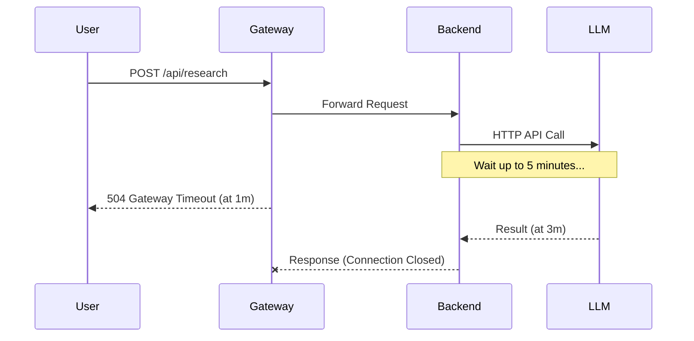
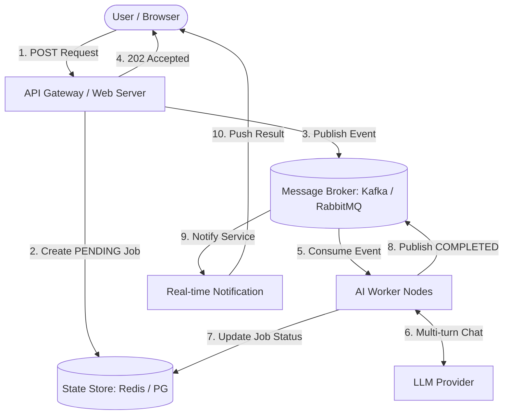

If you've ever built a sufficiently complex AI system, you've definitely encountered this error message: `504 Gateway Timeout`.

During the Proof of Concept (PoC) phase, everything looks perfect. The user enters a prompt, the backend calls the OpenAI API, waits about 3-5 seconds, and returns a smooth result. However, when moving to a Production environment with real-world problems, an AI Agent often has to execute long sequences of actions: calling a dozen different tools, automatically searching data, reasoning step-by-step (Chain-of-Thought), and even analyzing PDFs hundreds of pages long. Such a request doesn't take 5 seconds; it takes 2 minutes, 5 minutes, or even longer.

And this is where the synchronous (Request-Response) architecture reveals its fatal flaw. The API Gateway drops the connection. The Load Balancer terminates the request. The user's browser displays an endless spinning wheel.

For an AI system to truly "scale" and handle the load, we need a paradigm shift: stop forcing HTTP requests to bear the burden of LLM inference. Instead, we must transition to an **Event-driven Architecture (EDA)** using message brokers like Kafka, RabbitMQ, or AWS SQS.

In this article, we will dissect how to build an Event-driven architecture for AI Agents, completely solve the timeout problem, and turn a fragile system into a resilient asynchronous processing machine.

---

## The Fatal Flaw of Synchronous LLM Calls

Let's consider a real-world example: an **AI Research Assistant** system. The Agent's task is to receive a topic, automatically search Google, read content from 10 articles, synthesize it, and generate a 3-page report.

With a traditional architecture, the data flow looks like this:

1. User sends an HTTP POST request: `POST /api/research { "topic": "Event-driven architecture" }`
2. Backend receives the request and opens an HTTP connection with the LLM provider.
3. LLM performs multi-turn reasoning, possibly using a Web Search tool, which takes 3 minutes.
4. Backend waits in vain.
5. At minute 1, Nginx (or AWS API Gateway) automatically times out and closes the connection with the Client.
6. When the LLM finally returns the result at minute 3, the backend tries to send the response to the Client, but the connection is already closed. The result is thrown into the void. The API cost is incurred, but the User receives nothing.



Not only does it suffer from timeouts, but this architecture also wastes resources immensely. Web server threads are completely blocked while waiting for the LLM's response, leading to "thread starvation". When 100 users request simultaneously, the entire web server can become paralyzed even if CPU and RAM are largely idle.

## Transitioning to Event-driven AI Systems

The core idea of Event-driven AI is: **Decouple the receipt of the request from the execution of the request.**

Instead of having the web server wait for the LLM, we turn the user's request into an "Event" and drop it into a Message Queue/Broker. A cluster of specialized Workers will listen to this queue, process it silently in the background, and once completed, emit another event to announce the result.

### Overall Architecture

A standard architecture will include the following components:

1. **API Gateway / Web Server**: Only responsible for validation and publishing events.
2. **Message Broker (Kafka / RabbitMQ)**: The backbone of the system, storing and routing events.
3. **AI Worker Nodes**: Background processes responsible for communicating with the LLM and running the Agent's logic.
4. **State Store (Redis / PostgreSQL)**: Stores the current state of the Job (Pending, Processing, Completed, Failed).
5. **Real-time Notification (WebSockets / SSE)**: Pushes the result back to the user upon completion.



Let's look at the new processing flow:

1. User calls `POST /api/research`.
2. Web Server creates a `Job_ID` in the Database with a `PENDING` state, sends a `ResearchRequested` event to a Kafka topic, and then immediately returns `202 Accepted` along with the `Job_ID` to the User. The HTTP request finishes within 50ms.
3. The AI Worker listens to Kafka, picks up the `ResearchRequested` event for processing. It updates the state in the Database to `PROCESSING`.
4. The Worker begins a lengthy conversation with the LLM. Whether this process takes 5 minutes or 10 minutes, no HTTP connection is broken because the Worker and the LLM Provider communicate via an independent backend-to-backend mechanism.
5. Upon completion, the AI Worker saves the result to the Database, changes the state to `COMPLETED`, and publishes a `ResearchCompleted` event.
6. A WebSocket management service receives this event and fires a Notification back to the User's browser based on the `Job_ID`.

## "Blood and Tears" Lessons from Real-world Deployments

Event-driven architecture solves the timeout issue, but it introduces new complexities. Here are the lessons I learned after scaling a system from a few dozen to hundreds of thousands of requests per day.

### 1. Managing Retries and the Dead Letter Queue (DLQ)

LLMs are flaky APIs. They can be rate-limited (`429 Too Many Requests`), encounter server errors (`500 Internal Server Error`), or return improperly formatted JSON.

In a queue architecture, if an AI Worker encounters an error, you can easily configure an *Exponential Backoff Retry* mechanism. If after 3 attempts the LLM is still misbehaving, the event shouldn't be discarded; it must be pushed to a **Dead Letter Queue (DLQ)**.

```mermaid
graph LR
    MainQueue[Main Topic] -->|Consume| Worker[AI Worker]
    Worker -->|Fail 1| RetryQueue1[Retry Topic (Delay 10s)]
    RetryQueue1 -->|Consume| Worker
    Worker -->|Fail 2| RetryQueue2[Retry Topic (Delay 30s)]
    RetryQueue2 -->|Consume| Worker
    Worker -->|Fail 3| DLQ[(Dead Letter Queue)]
    DLQ -->|Manual Audit/Replay| Developer([AI Engineer])
```

The DLQ is a holding pen for failed requests so that AI engineers can analyze them later. Sometimes errors aren't caused by the network, but by an overly complex Prompt or Model "hallucination". The DLQ allows us to replay these events after fine-tuning the Prompt.

### 2. Handling "Zombie Agents" with Heartbeats

A major headache with AI Workers is that sometimes they... disappear without a trace (e.g., OOM killed, node crash). If a Worker crashes midway through a 10-minute task, the message can become permanently "stuck" in the `PROCESSING` state.

To resolve this, the AI Worker must continuously emit "Heartbeat" signals (for example, updating a `last_active_at` field in Redis every 30 seconds). If no heartbeat is detected for over 2 minutes, the system automatically considers the Worker dead, reverts the task to the `PENDING` state, and pushes it back into the Queue for another Worker to process.

### 3. Streaming Partial Responses (Advanced Optional)

One drawback of a fully Async architecture is that the UX can be a bit "boring". The user has to stare at a loading screen for 5 minutes without knowing what's going on.

A powerful technique is to combine Kafka with Server-Sent Events (SSE) or WebSockets to stream progress (Partial Responses). The AI Worker doesn't just publish the final result; as the Agent executes each Tool (e.g., "Searching Google...", "Reading document A...", "Drafting content..."), the Worker continuously publishes small `AgentStepCompleted` events to a separate topic.

The user's browser receives these events via WebSocket, creating the experience of "an Agent actively working right before your eyes," which significantly reduces wait-time anxiety.

## When NOT to Use This Architecture?

Although Event-driven is very powerful, it also brings infrastructure complexity (maintaining Kafka/RabbitMQ) and debugging difficulties (tracing distributed requests).

You **should not** use this architecture if:
- Your problem is simple RAG with latency under 3-5 seconds.
- It's a basic chat application that doesn't use complex tool calling.
- You have a small team without experience operating Message Brokers.

But once your AI system enters the world of Autonomous Agents—where AI can autonomously plan, browse the web, run code, and continuously debug itself over many minutes—Event-driven Architecture is no longer a "nice-to-have" option; it becomes a **necessity** for the system to survive in production.

---

*Is your AI system suffering from unnecessary HTTP connection drops? It's time to put your Agents in a queue and let them leisurely complete their tasks.*
