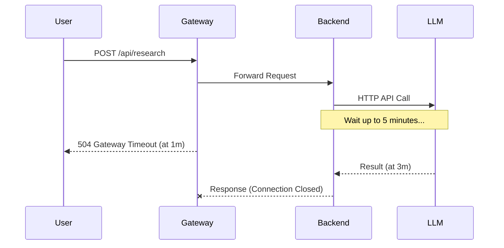
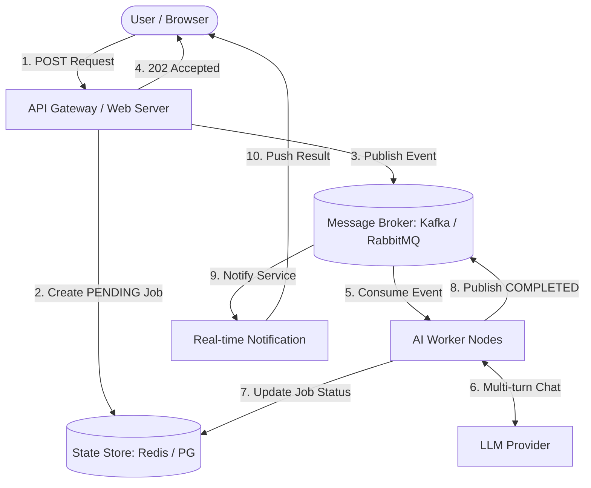

Nếu bạn đã từng xây dựng một hệ thống AI đủ phức tạp, bạn chắc chắn đã gặp thông báo lỗi này: `504 Gateway Timeout`.

Trong giai đoạn PoC (Proof of Concept), mọi thứ trông thật hoàn hảo. Người dùng nhập câu hỏi, backend gọi API của OpenAI, chờ khoảng 3-5 giây và trả về kết quả mượt mà. Tuy nhiên, khi chuyển sang môi trường Production với các bài toán thực tế, AI Agent thường phải thực thi những chuỗi hành động dài hơi: gọi một chục tools khác nhau, tự động search data, suy luận từng bước (Chain-of-Thought), và thậm chí phân tích những file PDF dày hàng trăm trang. Một request như vậy không mất 5 giây, mà nó mất 2 phút, 5 phút, hoặc lâu hơn.

Và đây là lúc kiến trúc đồng bộ (Synchronous Request-Response) bộc lộ tử huyệt. API Gateway ngắt kết nối. Load Balancer drop request. Trình duyệt của người dùng hiện vòng xoay vô tận.

Để một hệ thống AI thực sự "scale" và chịu tải, chúng ta cần thay đổi tư duy: ngừng bắt HTTP request phải gánh vác quá trình suy luận của LLM. Thay vào đó, hãy chuyển sang mô hình **Event-driven Architecture (EDA)** bằng cách sử dụng các message broker như Kafka, RabbitMQ hoặc AWS SQS.

Trong bài viết này, chúng ta sẽ cùng mổ xẻ cách xây dựng một kiến trúc Event-driven cho AI Agents, giải quyết triệt để bài toán timeout, và biến một hệ thống dễ vỡ thành một cỗ máy xử lý không đồng bộ bền bỉ.

---

## Tử huyệt của Synchronous LLM Calls

Hãy xem xét một ví dụ thực tế: Hệ thống **AI Research Assistant**. Nhiệm vụ của Agent là nhận một topic, tự động search Google, đọc nội dung từ 10 bài viết, tổng hợp và sinh ra một bản báo cáo dài 3 trang.

Với kiến trúc truyền thống, luồng dữ liệu trông như sau:

1. User gửi HTTP POST request: `POST /api/research { "topic": "Event-driven architecture" }`
2. Backend nhận request, mở kết nối HTTP với LLM provider.
3. LLM thực hiện nhiều lượt suy luận (multi-turn reasoning), có thể dùng Web Search tool, mất 3 phút.
4. Backend chờ đợi trong vô vọng.
5. Ở phút thứ 1, Nginx (hoặc AWS API Gateway) tự động timeout và đóng connection với Client.
6. Khi LLM trả về kết quả ở phút thứ 3, backend cố gắng gửi response cho Client nhưng kết nối đã bị đóng. Kết quả bị ném vào hư vô. Tiền API vẫn mất, nhưng User không nhận được gì.



Không chỉ gặp vấn đề về timeout, kiến trúc này còn cực kỳ lãng phí tài nguyên. Các web server threads bị block hoàn toàn trong thời gian chờ LLM phản hồi, dẫn đến tình trạng "thread starvation". Khi có 100 users cùng request một lúc, toàn bộ web server có thể tê liệt dù CPU và RAM vẫn đang rảnh rỗi.

## Chuyển dịch sang Event-driven AI Systems

Ý tưởng cốt lõi của Event-driven AI là: **Tách rời (Decouple) việc tiếp nhận yêu cầu khỏi việc thực thi yêu cầu.**

Thay vì để web server đứng đợi LLM, chúng ta biến yêu cầu của người dùng thành một "sự kiện" (Event) và thả nó vào một hàng đợi (Message Queue/Broker). Một cụm Worker chuyên biệt sẽ lắng nghe hàng đợi này, âm thầm xử lý, và sau khi hoàn thành, nó sẽ bắn ra một sự kiện khác để thông báo kết quả.

### Kiến trúc tổng thể

Một kiến trúc tiêu chuẩn sẽ bao gồm các thành phần sau:

1. **API Gateway / Web Server**: Chỉ làm nhiệm vụ validation và publish event.
2. **Message Broker (Kafka / RabbitMQ)**: Xương sống của hệ thống, lưu trữ và luân chuyển các events.
3. **AI Worker Nodes**: Các process chạy nền (background jobs) chịu trách nhiệm giao tiếp với LLM và chạy các logic của Agent.
4. **State Store (Redis / PostgreSQL)**: Lưu trữ trạng thái hiện tại của Job (Pending, Processing, Completed, Failed).
5. **Real-time Notification (WebSockets / SSE)**: Đẩy kết quả về cho người dùng khi hoàn thành.



Hãy xem luồng xử lý mới:

1. User gọi `POST /api/research`.
2. Web Server tạo một `Job_ID` trong Database với trạng thái `PENDING`, gửi một event `ResearchRequested` vào Kafka topic, sau đó ngay lập tức trả về `202 Accepted` kèm theo `Job_ID` cho User. HTTP request kết thúc trong vòng 50ms.
3. AI Worker lắng nghe Kafka, bốc event `ResearchRequested` ra xử lý. Nó update trạng thái trong Database thành `PROCESSING`.
4. Worker bắt đầu cuộc hội thoại dài hơi với LLM. Dù quá trình này mất 5 phút hay 10 phút, không có HTTP connection nào bị đứt gãy vì Worker và LLM Provider giao tiếp theo cơ chế backend-to-backend độc lập.
5. Khi hoàn thành, AI Worker lưu kết quả vào Database, đổi trạng thái thành `COMPLETED`, và publish event `ResearchCompleted`.
6. Một service quản lý WebSocket nhận event này và bắn Notification về cho trình duyệt của User dựa trên `Job_ID`.

## Những Bài Học "Xương Máu" Khi Triển Khai Thực Tế

Kiến trúc Event-driven giải quyết được timeout, nhưng nó cũng mang theo những phức tạp mới. Dưới đây là những bài học tôi rút ra sau khi scale hệ thống từ vài chục đến hàng trăm nghìn request mỗi ngày.

### 1. Quản lý Retries và Dead Letter Queue (DLQ)

LLM là những API không ổn định (flaky). Chúng có thể bị rate limit (`429 Too Many Requests`), bị lỗi server (`500 Internal Server Error`), hoặc trả về JSON không đúng format.

Trong kiến trúc queue, nếu AI Worker gặp lỗi, bạn có thể dễ dàng cấu hình cơ chế *Exponential Backoff Retry*. Nếu sau 3 lần thử mà LLM vẫn "dở chứng", event không nên bị vứt bỏ, mà phải được đẩy vào **Dead Letter Queue (DLQ)**.

```mermaid
graph LR
    MainQueue[Main Topic] -->|Consume| Worker[AI Worker]
    Worker -->|Fail 1| RetryQueue1[Retry Topic (Delay 10s)]
    RetryQueue1 -->|Consume| Worker
    Worker -->|Fail 2| RetryQueue2[Retry Topic (Delay 30s)]
    RetryQueue2 -->|Consume| Worker
    Worker -->|Fail 3| DLQ[(Dead Letter Queue)]
    DLQ -->|Manual Audit/Replay| Developer([AI Engineer])
```

DLQ là nơi "chứa chấp" những request thất bại để kỹ sư AI có thể phân tích sau. Đôi khi lỗi xảy ra không phải do mạng lưới, mà do Prompt quá phức tạp hoặc Model bị "ảo giác" (hallucination). DLQ cho phép ta replay lại những event này sau khi đã tinh chỉnh Prompt.

### 2. Xử lý "Zombie Agents" với Heartbeats

Một vấn đề đau đầu với AI Worker là đôi khi chúng... biến mất không dấu vết (bị OOM killed, node crash). Nếu Worker sập giữa chừng khi đang chạy dở một task mất 10 phút, message có thể bị "kẹt" vĩnh viễn ở trạng thái `PROCESSING`.

Để giải quyết, AI Worker cần phải liên tục phát ra tín hiệu "Heartbeat" (ví dụ: cứ mỗi 30 giây update một trường `last_active_at` trong Redis). Nếu quá 2 phút không thấy heartbeat, hệ thống sẽ tự động coi như Worker đã chết, đưa task về lại trạng thái `PENDING` và đẩy lại vào Queue cho một Worker khác xử lý.

### 3. Streaming Partial Responses (Tùy chọn nâng cao)

Một nhược điểm của kiến trúc Async hoàn toàn là UX có thể hơi "buồn chán". User phải nhìn màn hình loading 5 phút mà không biết chuyện gì đang xảy ra.

Một thủ thuật mạnh mẽ là kết hợp Kafka với Server-Sent Events (SSE) hoặc WebSockets để stream tiến độ (Partial Responses). AI Worker không chỉ publish kết quả cuối cùng, mà trong quá trình Agent thực thi từng Tool (ví dụ: "Đang tìm kiếm Google...", "Đang đọc tài liệu A...", "Đang nháp nội dung..."), Worker sẽ liên tục publish các sự kiện `AgentStepCompleted` nhỏ vào một topic khác.

Trình duyệt user nhận các sự kiện này qua WebSocket, tạo ra trải nghiệm "Agent đang làm việc thực sự trước mắt bạn", giúp giảm thiểu sự lo âu khi chờ đợi.

## Khi Nào Không Nên Dùng Kiến Trúc Này?

Dù Event-driven rất mạnh mẽ, nhưng nó cũng mang lại sự phức tạp về hạ tầng (phải maintain Kafka/RabbitMQ) và khó khăn khi debug (trace distributed requests).

Bạn **không nên** dùng kiến trúc này nếu:
- Bài toán của bạn là RAG đơn giản, latency dưới 3-5 giây.
- Ứng dụng chat cơ bản không dùng tool calling phức tạp.
- Team nhỏ chưa có kinh nghiệm vận hành Message Brokers.

Nhưng một khi hệ thống AI của bạn bước vào thế giới của Autonomous Agents, nơi AI có thể tự lên kế hoạch, duyệt web, chạy code, và sửa lỗi liên tục trong nhiều phút, thì Event-driven Architecture không còn là một lựa chọn "có thì tốt", mà nó là **sự bắt buộc** để hệ thống có thể tồn tại trên production.

---

*Hệ thống AI của bạn có đang chịu đựng những đứt gãy HTTP không đáng có? Đã đến lúc đưa Agent vào hàng đợi và để chúng thong thả hoàn thành nhiệm vụ.*
