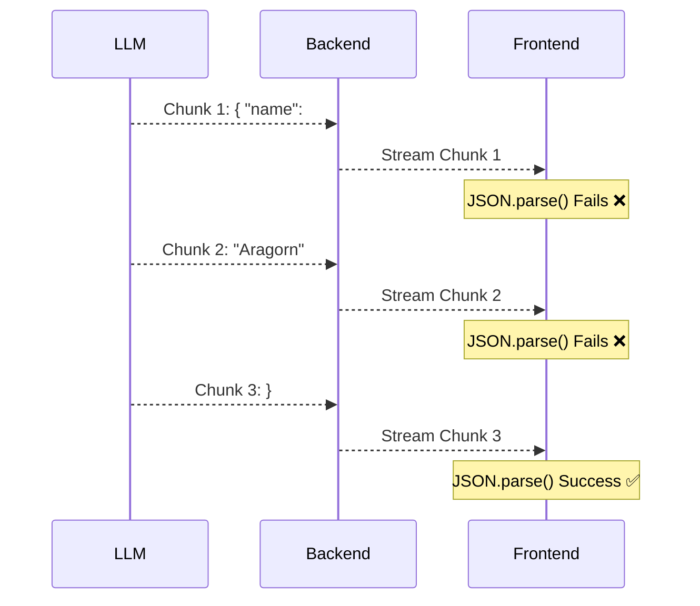
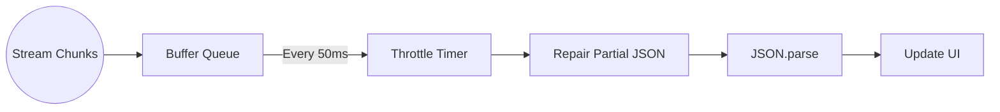

One of the gold standards for a modern AI application is "Streaming" capability (returning responses word-by-word like ChatGPT) rather than forcing users to stare at a loading spinner for 10 seconds.

But streaming plain text is easy. The real challenge begins when you don't just want plain text, but need the LLM to execute a Function/Tool Call or return structured data (a JSON object).

When an LLM streams JSON, it sends characters piece by piece like this: `{`, `"na`, `me": `, `"Al`, `ice"`, `}`. How can a Frontend application continuously parse and render this incomplete data (Partial JSON) without crashing the entire app with a `SyntaxError: Unexpected end of JSON input`?

In this article, we'll dissect the principles and practical solutions to handle Partial JSON Streaming as smoothly as possible.

---

## Why is Partial JSON so hard to handle?

Suppose your application asks an LLM to generate a game character profile in JSON format:

```json
{
  "name": "Aragorn",
  "class": "Ranger",
  "stats": { "strength": 85, "agility": 90 }
}
```

If you don't stream, you wait 5 seconds, receive the complete JSON, run `JSON.parse()`, and render it to the UI. Very safe.

But if you stream, at second 2, the received string chunk might only be:

```json
{
  "name": "Aragorn",
  "class": "Ran
```

This string is **invalid** JSON syntax. If you try to call `JSON.parse()`, the app crashes immediately. But if you don't parse it, you can't update the UI to show the user that their character is being generated.



Our goal is to "repair" this incomplete JSON string at every chunk so that `JSON.parse` succeeds and the Frontend gets the data as early as possible.

## Solution 1: Wait for Field Completion (Field-level Streaming)

The simplest solution isn't to parse partial JSON at all, but to **wait until a field is complete**.

Instead of trying to parse the whole massive JSON block, we listen to the stream, concatenate the string, and use Regex to find completed `key: value` pairs.

**Pros:**
- Easy to implement, no third-party libraries needed.
- Low CPU usage on the Frontend because it doesn't parse continuously.

**Cons:**
- Cannot stream text inside a very long string. For example, if a field is `"description": "a 500-word paragraph"`, the user still has to wait for the entire paragraph to finish before seeing it appear.

## Solution 2: Using Partial JSON Parsing Libraries

To solve this thoroughly, the community has developed specialized parsers capable of "closing" open curly braces, square brackets, and quotation marks.

Notable examples include libraries like `jsonrepair`, `partial-json`, or the built-in features in the Vercel AI SDK (`experimental_streamObject`).

The basic algorithm of these libraries acts as a state machine:
1. Read each character of the stream string.
2. Remember open tokens (e.g., `[`, `{`, `"`).
3. When the string is cut off, the algorithm automatically generates the corresponding closing tokens in reverse order (e.g., if `{` and `"` are open, it automatically appends `"` and `}` to the end).

```mermaid
graph TD
    Input[Input: { "name": "Ar] --> Parser[Partial JSON Parser]
    Parser --> |Step 1: Detect open string| Step1(Append closing quote)
    Step1 --> |Step 2: Detect open object| Step2(Append closing brace)
    Step2 --> Output[Output: { "name": "Ar" }]
    Output --> JSONParse[JSON.parse() succeeds]
```

### Practical Implementation with Vercel AI SDK

If you are working with React/Next.js/SvelteKit, the Vercel AI SDK is a lifesaver. It handles all the underlying complexities of Partial JSON.

Backend (Next.js App Router):
```javascript
import { streamObject } from 'ai';
import { openai } from '@ai-sdk/openai';
import { z } from 'zod';

export async function POST(req) {
  const result = await streamObject({
    model: openai('gpt-4o'),
    schema: z.object({
      recipeName: z.string(),
      ingredients: z.array(z.string()),
      instructions: z.string(),
    }),
    prompt: 'Create a recipe for pancakes',
  });

  return result.toTextStreamResponse();
}
```

Frontend (React):
```javascript
import { experimental_useObject as useObject } from 'ai/react';

export default function Recipe() {
  const { object, submit } = useObject({
    api: '/api/recipe',
    schema: recipeSchema,
  });

  return (
    <div>
      <button onClick={() => submit()}>Generate Recipe</button>

      {/* object can contain partial data */}
      <h1>{object?.recipeName || 'Thinking...'}</h1>
      <ul>
        {object?.ingredients?.map((item, i) => (
          <li key={i}>{item}</li>
        ))}
      </ul>
      <p>{object?.instructions}</p>
    </div>
  );
}
```

Vercel AI SDK uses schemas (Zod) to know the expected structure, automatically parses partial JSON chunks, and updates the React State continuously at 60fps.

## Performance Optimization Lessons

While using a Partial JSON library makes the UI update smoothly, it comes with a cost: **CPU Overhead**.

Running an auto-repair algorithm and `JSON.parse` on every 20-30 byte chunk (hundreds of times a second) can freeze the Browser's Main Thread on weaker mobile devices.

To optimize, apply a **Debouncing / Throttling** strategy:
- Do not update the UI state continuously on every chunk.
- Instead, buffer the chunks for 50ms - 100ms before running the repair and parse cycle once. The human eye cannot perceive the difference between 10ms and 50ms, but a mobile phone's CPU will thank you.



## Conclusion

Handling Partial JSON when streaming from LLMs is proof that AI Engineering isn't just about writing Prompts or RAG. It requires solid Software Engineering skills to master asynchronous data flows and optimize user experience.

With the help of modern libraries, this barrier is becoming easier to overcome. Next time you build an AI feature, don't hesitate to return a complex JSON object – your application is fully capable of displaying it magically in real-time.
