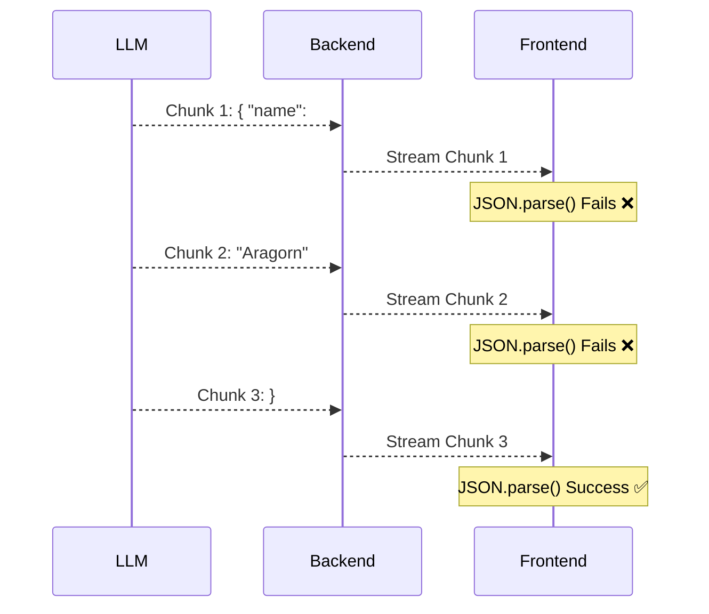
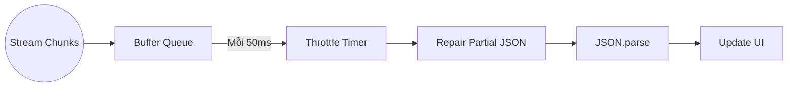

Một trong những tiêu chuẩn của một ứng dụng AI hiện đại là khả năng "Streaming" (trả về từng từ giống như ChatGPT) thay vì buộc người dùng phải nhìn màn hình loading suốt 10 giây.

Nhưng streaming text thông thường thì dễ. Bài toán thực sự khó bắt đầu khi bạn không chỉ trả về text thuần, mà yêu cầu LLM gọi Function/Tool (Tool Calling) hoặc trả về dữ liệu có cấu trúc (JSON object).

Khi LLM stream một JSON, nó sẽ gửi từng ký tự như thế này: `{`, `"na`, `me": `, `"Al`, `ice"`, `}`. Làm sao để ứng dụng Frontend có thể liên tục parse và render đoạn JSON chưa hoàn chỉnh (Partial JSON) này mà không làm sập toàn bộ ứng dụng vì lỗi `SyntaxError: Unexpected end of JSON input`?

Trong bài viết này, chúng ta sẽ mổ xẻ nguyên lý và các giải pháp thực tế để xử lý Partial JSON Streaming một cách mượt mà nhất.

---

## Vì sao Partial JSON lại khó xử lý?

Giả sử ứng dụng của bạn yêu cầu LLM sinh ra một profile nhân vật game dưới định dạng JSON:

```json
{
  "name": "Aragorn",
  "class": "Ranger",
  "stats": { "strength": 85, "agility": 90 }
}
```

Nếu không stream, bạn sẽ đợi 5 giây, nhận toàn bộ JSON, chạy `JSON.parse()` và render lên UI. Rất an toàn.

Nhưng nếu bạn stream, ở giây thứ 2, chuỗi dữ liệu nhận được có thể mới chỉ là:

```json
{
  "name": "Aragorn",
  "class": "Ran
```

Chuỗi này **không hợp lệ** trong cấu trúc JSON. Nếu bạn cố gắng gọi `JSON.parse()`, ứng dụng sẽ crash ngay lập tức. Nhưng nếu bạn không parse, bạn không thể update giao diện để user thấy nhân vật đang được tạo ra.



Mục tiêu của chúng ta là "sửa chữa" chuỗi JSON đang dở dang này ở mỗi chunk để `JSON.parse` có thể thành công và Frontend lấy được data sớm nhất có thể.

## Giải pháp 1: Chờ hoàn thành từng trường (Field-level Streaming)

Giải pháp đơn giản nhất không phải là parse partial JSON, mà là **đợi cho đến khi một field hoàn chỉnh**.

Thay vì cố gắng parse cả cục JSON lớn, chúng ta lắng nghe stream, ghép chuỗi lại, và dùng Regex để tìm các cặp `key: value` đã hoàn thành.

**Ưu điểm:**
- Dễ implement, không cần thư viện bên thứ 3.
- Ít tốn CPU trên Frontend vì không phải parse liên tục.

**Nhược điểm:**
- Không stream được text bên trong một chuỗi quá dài. Ví dụ nếu field là `"description": "một đoạn văn 500 chữ"`, user vẫn phải đợi cả đoạn văn hoàn thành mới thấy nó xuất hiện.

## Giải pháp 2: Sử dụng các thư viện Partial JSON Parsing

Để giải quyết triệt để, cộng đồng đã phát triển các bộ parser chuyên dụng có khả năng "đóng lại" các ngoặc nhọn, ngoặc vuông và dấu nháy kép đang mở.

Ví dụ nổi bật là các thư viện như `jsonrepair`, `partial-json` hoặc các tính năng tích hợp sẵn trong Vercel AI SDK (`experimental_streamObject`).

Thuật toán cơ bản của các thư viện này hoạt động như một state machine:
1. Đọc từng ký tự của chuỗi stream.
2. Ghi nhớ các dấu mở (ví dụ: `[`, `{`, `"`).
3. Khi chuỗi bị cắt ngang, thuật toán tự động sinh ra các dấu đóng tương ứng theo thứ tự ngược lại (ví dụ: đang mở `{` và `"` thì sẽ tự động thêm `"` và `}` vào cuối).

```mermaid
graph TD
    Input[Input: { "name": "Ar] --> Parser[Partial JSON Parser]
    Parser --> |Bước 1: Nhận diện đang mở string| Step1(Thêm dấu nháy đóng)
    Step1 --> |Bước 2: Nhận diện đang mở object| Step2(Thêm dấu ngoặc nhọn đóng)
    Step2 --> Output[Output: { "name": "Ar" }]
    Output --> JSONParse[JSON.parse() thành công]
```

### Triển khai thực tế với Vercel AI SDK

Nếu bạn đang làm việc với React/Next.js/SvelteKit, Vercel AI SDK là một "cứu cánh". Nó đã xử lý toàn bộ sự phức tạp của Partial JSON ở phía dưới.

Backend (Next.js App Router):
```javascript
import { streamObject } from 'ai';
import { openai } from '@ai-sdk/openai';
import { z } from 'zod';

export async function POST(req) {
  const result = await streamObject({
    model: openai('gpt-4o'),
    schema: z.object({
      recipeName: z.string(),
      ingredients: z.array(z.string()),
      instructions: z.string(),
    }),
    prompt: 'Tạo công thức làm bánh xèo',
  });

  return result.toTextStreamResponse();
}
```

Frontend (React):
```javascript
import { experimental_useObject as useObject } from 'ai/react';

export default function Recipe() {
  const { object, submit } = useObject({
    api: '/api/recipe',
    schema: recipeSchema,
  });

  return (
    <div>
      <button onClick={() => submit()}>Tạo công thức</button>

      {/* object có thể chứa partial data */}
      <h1>{object?.recipeName || 'Đang nghĩ...'}</h1>
      <ul>
        {object?.ingredients?.map((item, i) => (
          <li key={i}>{item}</li>
        ))}
      </ul>
      <p>{object?.instructions}</p>
    </div>
  );
}
```

Vercel AI SDK sử dụng schema (Zod) để biết cấu trúc dự kiến, và tự động parse các chunk partial JSON, sau đó update State trong React liên tục với tốc độ 60fps.

## Bài học tối ưu hiệu năng (Performance)

Mặc dù việc sử dụng thư viện Partial JSON giúp UI cập nhật mượt mà, nó đi kèm một cái giá: **CPU Overhead**.

Việc chạy thuật toán tự sửa JSON và gọi `JSON.parse` trên mỗi chunk 20-30 byte (khoảng vài trăm lần một giây) có thể làm treo Main Thread của trình duyệt trên các thiết bị di động yếu.

Để tối ưu, hãy áp dụng chiến thuật **Debouncing / Throttling**:
- Không update state UI liên tục ở mỗi chunk.
- Thay vào đó, thu thập các chunk trong khoảng 50ms - 100ms rồi mới tiến hành repair và parse một lần. Mắt người không thể nhận ra sự khác biệt giữa 10ms và 50ms, nhưng CPU của điện thoại sẽ cảm ơn bạn.



## Kết luận

Xử lý Partial JSON khi streaming từ LLM là một minh chứng cho thấy AI Engineering không chỉ nằm ở việc viết Prompt hay RAG. Nó đòi hỏi kỹ năng Software Engineering vững vàng để làm chủ luồng dữ liệu bất đồng bộ và tối ưu hóa trải nghiệm người dùng.

Với sự trợ giúp của các thư viện hiện đại, rào cản này đang ngày càng dễ vượt qua. Lần tới khi xây dựng một AI feature, đừng ngần ngại trả về một cục JSON phức tạp – ứng dụng của bạn hoàn toàn có khả năng hiển thị nó một cách kỳ diệu theo thời gian thực.
